# How cercit works

cercit is a car-loan platform for salaried customers in India. A customer applies on the website, the system reads their documents and checks their credit, the credit rules recommend a decision, and an officer decides. After approval the customer accepts the offer, signs, sets up the EMI debit, and the loan is paid out to the dealer and repaid month by month.

This pack explains how, for a reader new to it first, with the technical detail underneath. The charts are drawn in Mermaid, so they show as pictures on GitHub.

## The pages

| Page | What it covers | Kept up to date by |
|---|---|---|
| [**Flow charts**](flows.md) | A chart for each stage: onboarding, documents and checks, bureau and income, the engine and risk model, the officer's decision, offer and agreement, disbursal, repayments and NPA, the daily simulation, and changing the policy or prices. Who acts, what is checked, the outcomes, the screen and the database function | Hand-written; update when a stage changes |
| [**Parts of the system**](components.md) | The website, the database, the AWS document service, the policy engine, the risk model, the simulators and the tests: what each does, what it talks to, where the code lives | Hand-written |
| [**Database schema**](schema.md) | Every table by area (customers and applications, documents, bureau, income and bank, decisions and policy, pricing and employers, loans, users and roles, settings and audit) with diagrams and every column | Generated from the real schema |
| [**Migrations**](migrations.md) | Every database change, 001 onwards, in run order, with what each does and the tables it creates | Generated |
| [**Database functions**](functions.md) | Every database function by stage: what it does, who may call it, the rights it checks | Generated (key descriptions in `scripts/how-it-works/key-functions.mjs`) |
| [**Glossary**](glossary.md) | FOIR, LTV, DPD, NPA, PAR, no-hit, KFS and the other terms | Hand-written |

The generated pages come from `node scripts/how-it-works/generate.mjs`, which builds the database locally from the migrations (nothing is read from the live database) and writes them again. Run it after adding a migration.

## In one picture

```mermaid
flowchart LR
  classDef cust fill:#dbeafe,stroke:#2563eb,color:#1e3a8a
  classDef sys fill:#dcfce7,stroke:#16a34a,color:#14532d
  classDef staff fill:#ffedd5,stroke:#ea580c,color:#7c2d12

  A["Customer applies: details, car, documents"]:::cust --> B["System reads and checks the documents"]:::sys
  B --> C["Two bureaus, income and bank checked"]:::sys
  C --> D["Credit rules and risk model: approve, refer or decline"]:::sys
  D --> E["Officer decides: in principle, then final"]:::staff
  E --> F["Customer accepts the offer, signs, sets up the EMI debit"]:::cust
  F --> G["Loan paid to the dealer"]:::staff
  G --> H["Repayments, tracked to the day; late loans followed"]:::sys
```

## What is real and what is simulated

In this demo the bureau reports, the mobile code, the employer checks, e-NACH and e-sign are **simulated** and marked so wherever they show. Most of the cases and loans are **synthetic** (made up), including a daily simulation that keeps the book moving; it must be removed before real customers (`docs/production-checklist.md`). The document reading (AWS Textract and Rekognition), the email codes, the credit rules, the approvals and the audit log are real.

## Where else to look

- `docs/fix-list.md`: what was fixed and when, and what is still open
- `docs/migration-run-log.md`: which database changes have been run on the live system
- `docs/production-checklist.md`: what must change before real customers
- `docs/risk-model-v2.md`: how the risk model was built and chosen
- `docs/application_flow.md`, `docs/current_state_workflow.md`: earlier write-ups of the flow (older; this pack supersedes them where they differ)

**Where everything lives:** which model or engine does each job, where it runs (everything with customer data runs in Mumbai), where each kind of data is kept, and the team that built it: [where-things-live.md](where-things-live.md).
