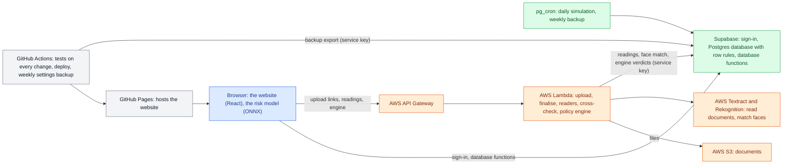

# The parts of cercit and how they talk to each other

What each part does, what it talks to, and where its code lives.

[← Back to the overview](README.md)

## The website

| | |
|---|---|
| **What it does** | Every screen: the public pages, the customer's application (steps 1–4, tracking, My loan), and the staff side (dashboard, applications, case review, customer applications, approvals, portfolio, policy rules, document checks, employer master, rate grid, users, roles, organisation, audit log). Shows only what the signed-in person's role may see (the database decides; the website follows). Without a database connection it runs in sample mode with made-up records, clearly labelled. |
| **Talks to** | Supabase (sign-in and database functions), the AWS API (uploads, document readings, the AWS policy engine) |
| **Built with** | React, TanStack Router, Tailwind and shadcn/ui, Vite; hosted on GitHub Pages (`.github/workflows/deploy.yml`); also builds for Cloudflare Pages (`npm run build:cf`) |
| **Code** | `src/routes/` (one file per page), `src/components/` (screen parts), `src/lib/*-api.ts` (one file per area of database functions), `src/lib/permissions.ts` (rights for the menu and buttons), `src/lib/doc-pdf.ts` (sanction letter, KFS, agreement and other letters) |

## The database (Supabase)

| | |
|---|---|
| **What it does** | Holds every record and does every decision-making step: the credit rules, the recommendation, the officer's decision, the offer, the repayment history, the audit log. The website reads and writes almost entirely through database functions ([functions.md](functions.md)) that check the caller's rights first; row rules stop anyone reading a table they shouldn't. PAN and mobile numbers are encrypted at rest and shown masked unless a role may reveal them. Credit policy and prices are versioned and change only through a second person's approval. A customer's personal data can be erased on request, within the legal retention rules (`docs/data-protection.md`). |
| **Talks to** | The website, the AWS Lambdas (with the service key), pg_cron (scheduled jobs) |
| **Built with** | Postgres 15 on Supabase, Supabase Auth (passwords and email codes), pg_cron, pgcrypto |
| **Code** | `sql/NNN_*.sql`, run in order ([migrations.md](migrations.md)); what has been run live: `docs/migration-run-log.md`; tables: [schema.md](schema.md) |

## The AWS document service

| | |
|---|---|
| **What it does** | Hands out one-time upload links; opens password-protected files once (the password is never stored), masks the Aadhaar number, files each document; reads the fields from each kind of document; matches the live photo against the PAN and Aadhaar photos; cross-checks the documents against each other; saves what it read into the database. |
| **Talks to** | The website (through API Gateway), S3, Textract, Rekognition, the database |
| **Built with** | AWS SAM (`aws/template.yaml`): 12 Lambda functions in Python, one shared layer, an S3 bucket, an API (`/upload`, `/finalize`, `/document-url`, `/resume`, `/extraction/{id}`, `/validate/{id}`, `/evaluate`, `/simulate`, `/assess`) |
| **Code** | `aws/lambdas/`: `presigned_url`, `document_finalize` (unlock, mask, face match), `kyc_extractor`, `salary_slip_extractor`, `bank_statement_extractor`, `form16_extractor`, `bureau_extractor`, `cross_validator`, `policy_engine`, `shared/` |

## The policy engine

| | |
|---|---|
| **What it does** | Checks every active credit rule against a case and gives approve, refer or decline with the reasons. It runs in the database (`fn_run_policy_engine`, `fn_generate_recommendation`); the same rules, as the approved and versioned policy, also run on AWS (`policy_engine` Lambda), which records its verdict for comparison and, with the `server_engine` switch on, sets the decision. |
| **Talks to** | The database (rules, facts, decisions) |
| **Code** | `sql/004`, `031`, `053`, `070` (database engine), `aws/lambdas/policy_engine/` (AWS engine), `tests/policy/` (the same test cases run against both) |

## The risk model

| | |
|---|---|
| **What it does** | A second opinion on each case: the chance the loan goes 90+ days late, and a grade. It doesn't decide; it is shown next to the engine's answer. Version 2, trained on the platform's own synthetic book, is the approved model; every decision records which model was in force. |
| **Talks to** | Runs in the browser; reads its 18 inputs from the database (`fn_staff_risk_features`) |
| **Built with** | XGBoost, exported to ONNX, run with onnxruntime-web |
| **Code** | `scripts/train-model.py`, `scripts/local/export-seasoned-training.mjs` (training data), `public/models/cercit-risk-v2.onnx`, `src/lib/onnx-inference.ts`, `src/lib/ml-features.ts`; write-up: `docs/risk-model-v2.md` |

## The simulators

No live bureau, SMS, e-NACH or employer-check provider is connected yet. Each stand-in is marked as simulated wherever its result shows, so it is never mistaken for a real check.

| Simulator | What it stands in for | Code |
|---|---|---|
| Bureau | CIBIL plus one other bureau: accounts, 24 months of payments, enquiries; the same PAN always gets the same report | `sql/053` (`fn_bureau_pull_simulated`) |
| Income and bank | Salary slips, Form 16 and bank statements for synthetic customers | `sql/054` (`fn_simulate_income_detail`) |
| Synthetic customers | 2,000+ made-up customers run through the real checks and engine, then disbursed with seasoned repayment histories | `sql/055`, `056` |
| Daily simulation | New leads, disbursals and payments every day (remove before real use) | `sql/075` |
| Employer checks | MCA (CIN), GSTIN, stock exchange and government lists | `sql/069` (provider `SIMULATED`) |
| Mobile code, e-NACH, e-sign | SMS OTP, auto-debit mandate, Aadhaar eSign | `sql/043`, `049` |

## The tests

| Test | What it checks | How to run |
|---|---|---|
| SQL tests | Every migration in a local Postgres (PGlite), then 58 sections: rights, privacy, the engine, the workflows, the advisor checks | `node tests/sql/run.mjs` |
| Policy tests | 40 test cases against the credit rules; the database and AWS engines agree | `npm run test:policy`, `npm run test:rules`, `npm run test:parity` |
| Lambda tests | The AWS policy engine and the document helpers | `npm run test:lambda` |
| Site tests | Public pages; every staff page as each role (H1); phone layout (H4) | `npx playwright test` (logins from the environment) |
| On every change | Type check, policy, rules, SQL and parity tests, Lambda tests | `.github/workflows/verify.yml` |
