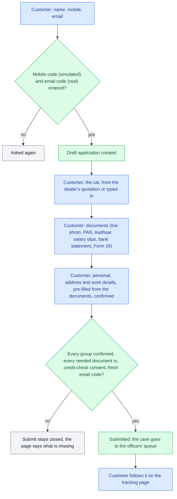
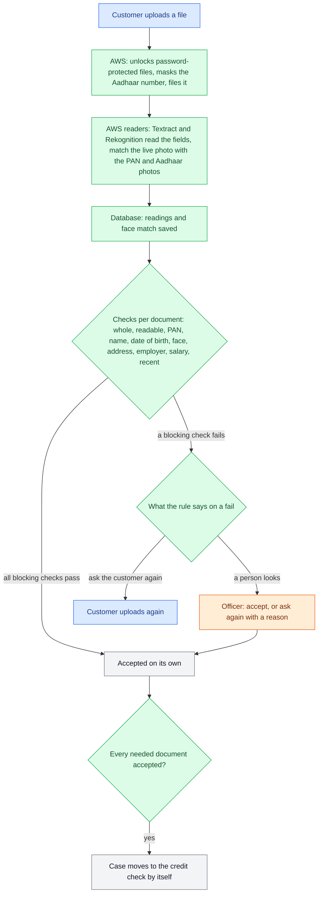
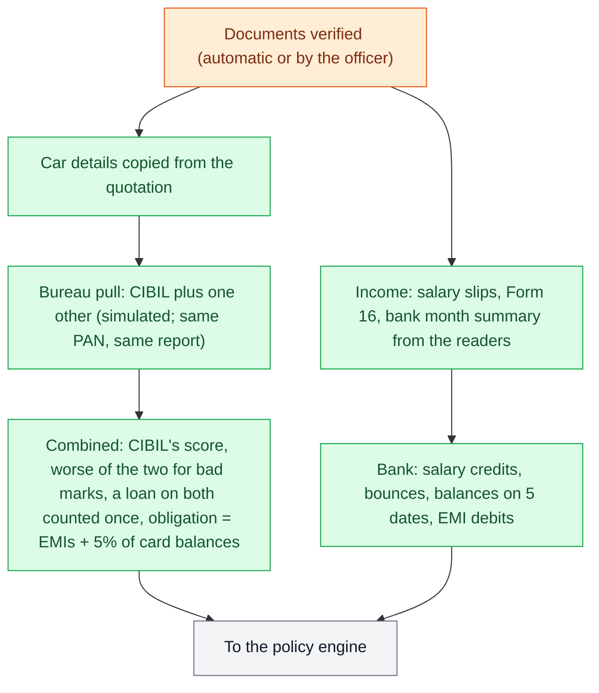
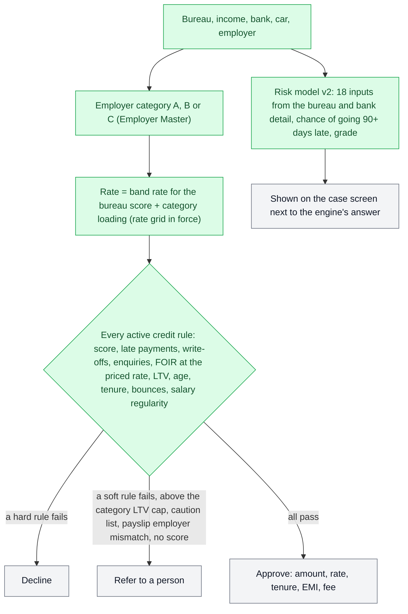
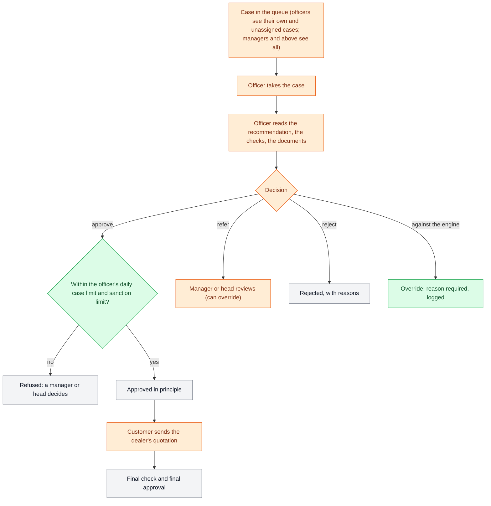
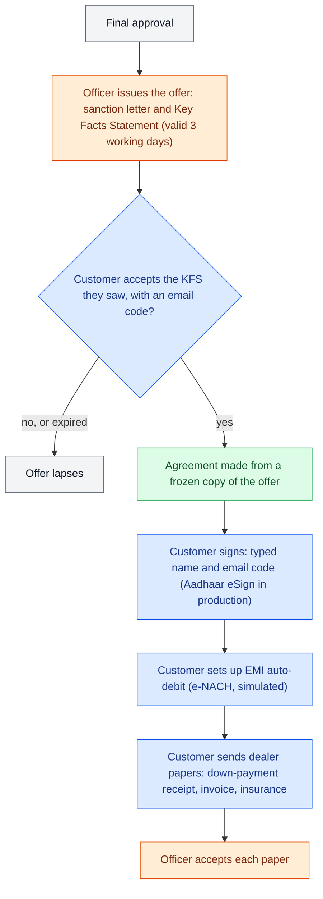
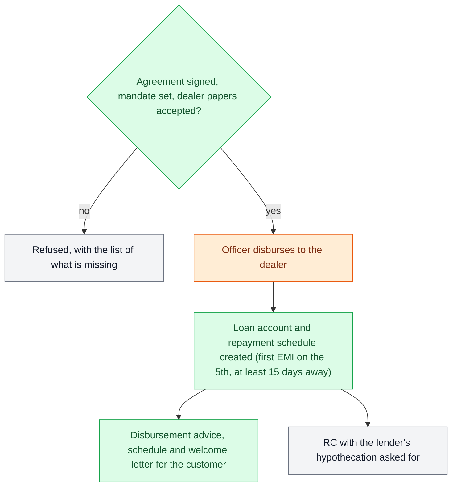
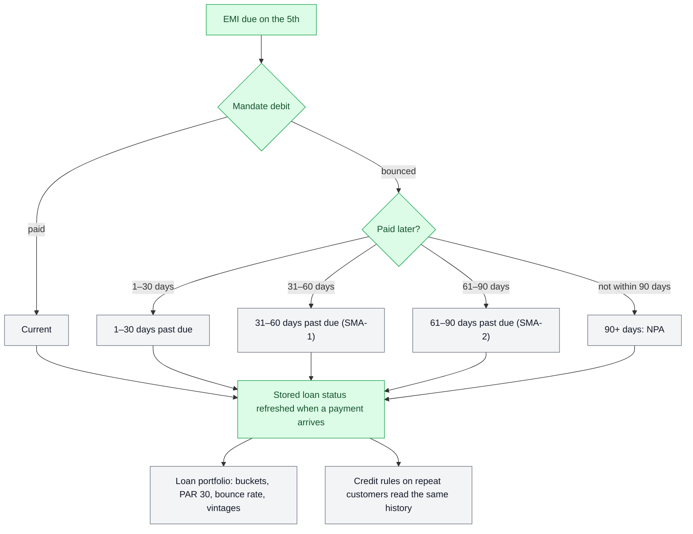
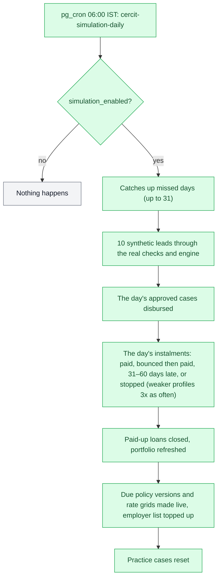
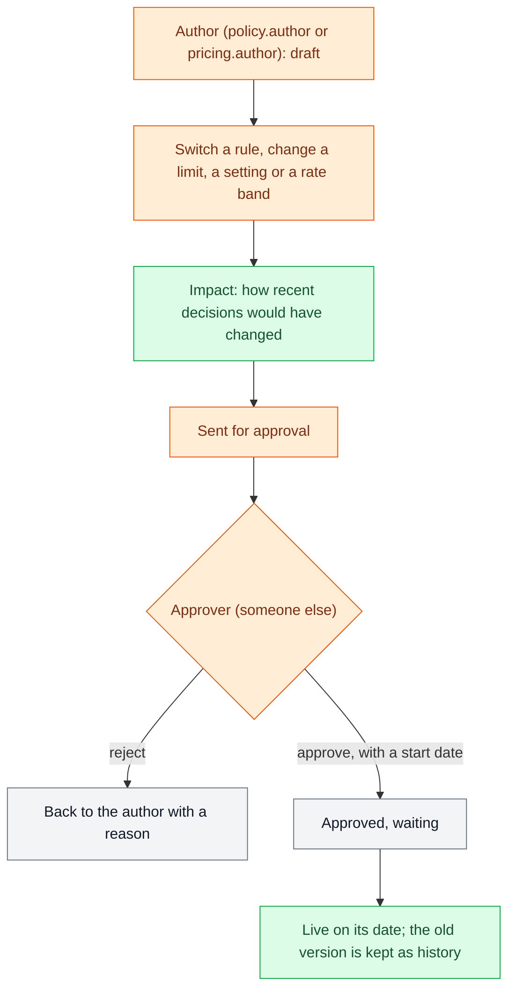

# How a loan moves through cercit: the flow charts

One chart per stage, in the order a loan goes through them. Each shows who acts (customer, system, officer, manager or head), what is checked and the possible outcomes; the table under it names the screen and the database function for each step. Function names link to their description in [functions.md](functions.md).

[← Back to the overview](README.md)

- [1. Customer onboarding (steps 1–4)](#1-customer-onboarding-steps-14)
- [2. Documents and automatic checks](#2-documents-and-automatic-checks)
- [3. Bureau and income checks](#3-bureau-and-income-checks)
- [4. Policy engine and risk model](#4-policy-engine-and-risk-model)
- [5. Officer decision: in principle, then final](#5-officer-decision-in-principle-then-final)
- [6. Offer, agreement and mandate](#6-offer-agreement-and-mandate)
- [7. Disbursal](#7-disbursal)
- [8. Repayments, late payments and NPA](#8-repayments-late-payments-and-npa)
- [9. The daily simulation](#9-the-daily-simulation)
- [10. Changing the credit policy or the prices](#10-changing-the-credit-policy-or-the-prices)

Colours: blue = customer, green = system (database or AWS), orange = staff, grey = an outcome.

---

## 1. Customer onboarding (steps 1–4)

The customer applies on the website in four steps. Every read and write goes through a database function that only ever touches the customer's own draft; a staff login can't apply as a customer.

| Step | Who | Screen | Database function |
|---|---|---|---|
| Start, codes | Customer | Apply → sign-in | `fn_customer_start` |
| Car | Customer | Onboarding: car | `fn_customer_save_vehicle` |
| Documents | Customer, AWS upload service | Onboarding: documents | `fn_customer_can_upload`, `fn_customer_register_document`, `fn_document_upload_types` |
| Details | Customer | Onboarding: details | `fn_customer_details`, `fn_customer_save_details` |
| Consent and submit | Customer | Onboarding: details | `fn_consent_text`, `fn_customer_submit` |
| Tracking | Customer | Application status | `fn_customer_track` |

## 2. Documents and automatic checks

Each file goes to the AWS document service, which reads it and saves what it read. Rules (not people) then check each document; what is checked, whether it blocks and what happens on a fail are settings on the Document checks page.

| Step | Who | Screen | Database function / service |
|---|---|---|---|
| Upload link, finalise | AWS | — | Lambdas `presigned_url`, `document_finalize` |
| Reading | AWS | — | Lambdas `kyc_extractor`, `salary_slip_extractor`, `bank_statement_extractor`, `form16_extractor`, `bureau_extractor`, `cross_validator`; `fn_record_document_reading`, `fn_record_face_match` |
| Checks | System | Document checks (settings) | `fn_auto_review_documents`, `fn_doc_check` |
| A person looks | Officer | Customer applications → case | `fn_staff_customer_action` (ACCEPT_DOC, REQUEST_DOC) |

## 3. Bureau and income checks

| Step | Who | Screen | Database function |
|---|---|---|---|
| Run the checks | System, or officer ("Run credit checks") | Customer applications → case | `fn_staff_customer_run_checks` |
| Bureau | System | Application Review → Bureau | `fn_bureau_pull_simulated`, `fn_bureau_combine` |
| Income and bank | System | Application Review → Income | `fn_reading_summary`, `fn_record_income_detail` |

## 4. Policy engine and risk model

The decision is worked out in the database from the credit rules in force; the risk model gives a second opinion. Every recommendation is stamped with the policy version, the rules and the model used, so it can be explained later.

| Step | Who | Screen | Database function / code |
|---|---|---|---|
| Assessment | System | Application Review | `fn_assess_application` |
| Rules | System | Policy Rules (the rules) | `fn_run_policy_engine` |
| Recommendation | System | Application Review → Overview | `fn_generate_recommendation`, `fn_case_employer_category` |
| Same rules on AWS (switchable) | AWS policy engine | — | Lambda `policy_engine`, `fn_policy_facts`, `fn_engine_decision_record` |
| Risk score | Browser (ONNX model) | Application Review → ML risk card | `fn_staff_risk_features`; `src/lib/onnx-inference.ts` |

## 5. Officer decision: in principle, then final

A case is approved twice: in principle on the customer's documents, then finally once the dealer's quotation is in. A person always decides; deciding against the engine needs a reason and is logged as an override.

| Step | Who | Screen | Database function |
|---|---|---|---|
| Queue | Officer, manager | Applications, Customer applications | `fn_list_applications_page`, `fn_staff_customer_queue`, `fn_staff_case_scope` |
| Take, decide | Officer | Customer applications → case | `fn_staff_customer_action` (ASSIGN_TO_ME, DECIDE, MOVE_TO_FINAL) |
| Decide (staff-entered cases) | Officer, manager | Application Review | `fn_officer_decision` |
| Limits | System | Users (limits per user) | `fn_check_officer_limits` |

## 6. Offer, agreement and mandate

| Step | Who | Screen | Database function |
|---|---|---|---|
| Offer | Officer | Application Review → after approval | `fn_staff_issue_offer` |
| Accept, sign, mandate | Customer | My loan | `fn_customer_after_approval`, `fn_customer_accept_offer`, `fn_customer_sign_agreement`, `fn_customer_set_mandate` |
| Papers | Customer, officer | My loan; case screen | `fn_customer_register_document`, `fn_staff_customer_action` (ACCEPT_DOC); the officer's view: `fn_staff_after_approval` |

## 7. Disbursal

| Step | Who | Screen | Database function |
|---|---|---|---|
| Disburse | Officer (app.decide) | Application Review → after approval | `fn_staff_disburse` |
| Letters | Website | My loan, case screen | `src/lib/doc-pdf.ts` from `fn_after_approval_data` |

## 8. Repayments, late payments and NPA

A payment can arrive in several attempts; an instalment is cleared on the day the money adds up to the amount due (a shortfall under ₹100 is not a delay). Days late is the gap between the due date and that day.

| Step | Who | Screen | Database function |
|---|---|---|---|
| Status per instalment | System | — | `fn_loan_installment_status` |
| Stored status | System | — | `fn_mark_loan_stale`, `fn_loan_status_refresh` |
| Portfolio | Manager, head | Loan portfolio, Dashboard | `fn_staff_loan_portfolio`, `fn_staff_dashboard` |

## 9. The daily simulation

So the demo's book keeps moving, a job runs every morning at 06:00 India time on synthetic data only. **Remove before real use** (`docs/production-checklist.md`).

| Step | Who | Screen | Database function |
|---|---|---|---|
| The run | pg_cron | Dashboard (recent days) | `fn_sim_daily`, `fn_sim_leads`, `fn_sim_disburse_day`, `fn_sim_payments_day`, `fn_sim_recent_days` |
| The generator | System | — | `fn_synthetic_generate`, `fn_synthetic_disburse` |
| Practice reset | System | — | `fn_practice_reset` |

## 10. Changing the credit policy or the prices

Nobody changes a rule or a price alone: one person drafts, another approves with a start date, and the change goes live on that date. Old versions stay, so every past decision can be explained by the version it was made under.

| Step | Who | Screen | Database function |
|---|---|---|---|
| Draft, edit | Policy author | Policy Rules | `fn_policy_draft_create`, `fn_policy_rule_draft`, `fn_policy_draft_set_param` |
| Impact | System | Approvals | `fn_policy_impact` |
| Approve | Policy approver | Approvals | `fn_policy_submit`, `fn_policy_approve`, `fn_policy_reject` |
| Live | System (daily) | — | `fn_policy_activate_due` |
| Prices | Pricing author, pricing approver | Rate Grid | `fn_rate_grid_draft_create`, `fn_rate_grid_draft_save`, `fn_rate_grid_submit`, `fn_rate_grid_decide`, `fn_rate_grid_activate_due` |
| Employer category | Employer manager, a second person | Employer Master | `fn_employer_request_category`, `fn_employer_decide_category` |
