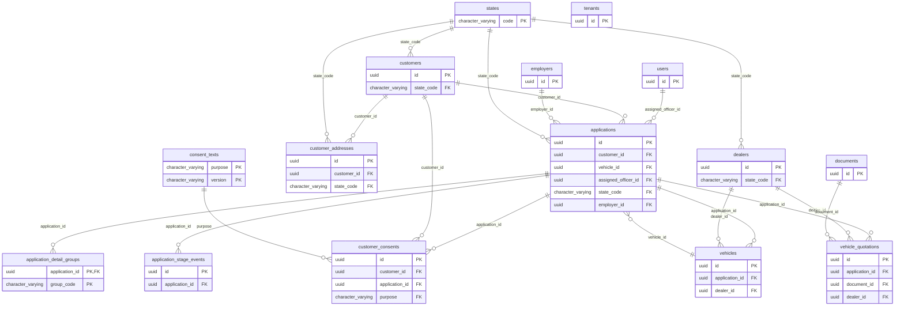
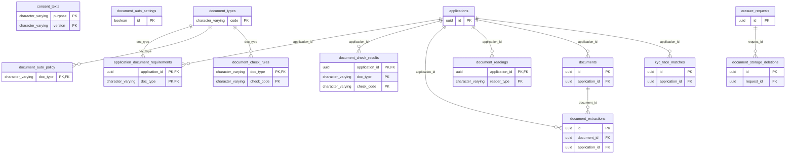
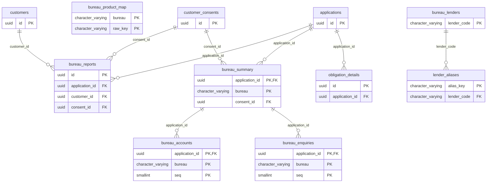
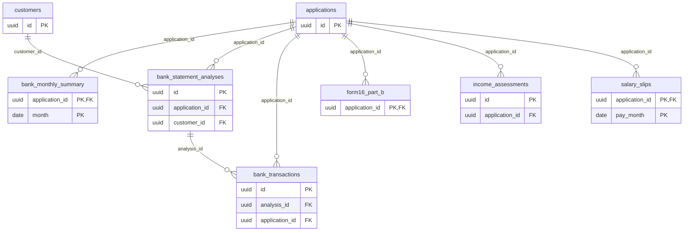
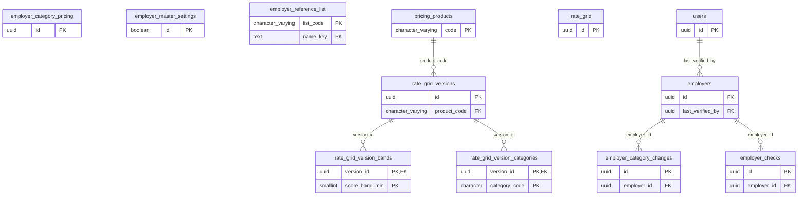
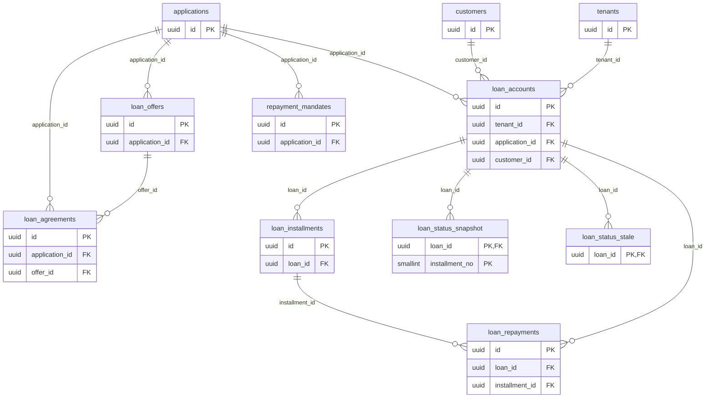
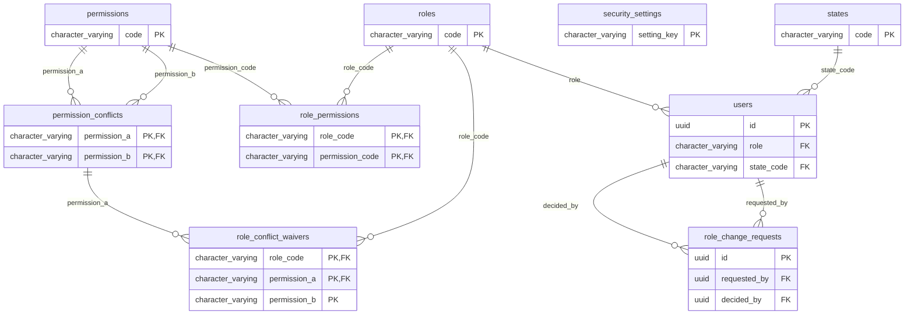

# Database schema

_Generated by `scripts/how-it-works/generate.mjs` from the 80 migrations (001–080) on 2026-10-03. Don't edit by hand: re-run the script._

Every table in the database, grouped by area. Each diagram shows the tables of one area with their key columns (PK = the row's own id, FK = a link to another table); a table from another area appears when something links to it. Under each diagram, every table's columns.

[← Back to the overview](README.md)

**96 tables, 1194 columns, 120 links.**

- [Customers and applications](#customers-and-applications) (11 tables)
- [Documents and automatic checks](#documents-and-automatic-checks) (12 tables)
- [Bureau](#bureau) (8 tables)
- [Income and bank](#income-and-bank) (6 tables)
- [Decisions and policy](#decisions-and-policy) (20 tables)
- [Pricing and employers](#pricing-and-employers) (11 tables)
- [Loans and repayments](#loans-and-repayments) (8 tables)
- [Users and roles](#users-and-roles) (8 tables)
- [Settings, audit and simulation](#settings-audit-and-simulation) (12 tables)

## Customers and applications

<b>application_detail_groups</b> (6 columns, from 046)

| Column | Type | Required | Note |
|---|---|---|---|
| application_id | uuid | yes | id; → applications |
| group_code | character varying(12) | yes | id |
| prefilled | jsonb | yes |  |
| confirmed | jsonb | yes |  |
| edited_fields | text[] | yes |  |
| confirmed_at | timestamp with time zone | yes |  |

<b>application_stage_events</b> (5 columns, from 046)

| Column | Type | Required | Note |
|---|---|---|---|
| id | uuid | yes | id |
| application_id | uuid | yes | → applications |
| stage | character varying(20) | yes |  |
| note | text |  |  |
| at | timestamp with time zone | yes |  |

<b>applications</b> (46 columns, from 001)

| Column | Type | Required | Note |
|---|---|---|---|
| id | uuid | yes | id |
| application_id | character varying(14) | yes |  |
| customer_id | uuid | yes | → customers |
| vehicle_id | uuid |  | → vehicles |
| status | character varying(30) | yes |  |
| current_step | smallint | yes |  |
| loan_amount_requested | numeric(12,2) |  |  |
| down_payment | numeric(12,2) |  |  |
| tenure_months | smallint |  |  |
| purpose | character varying(20) |  |  |
| exchange_vehicle_detail | text |  |  |
| exchange_existing_loan | boolean |  |  |
| exchange_outstanding_amount | numeric(12,2) |  |  |
| exchange_monthly_emi | numeric(10,2) |  |  |
| declared_net_salary | numeric(10,2) |  |  |
| declared_other_income | numeric(10,2) |  |  |
| other_income_source | character varying(100) |  |  |
| declared_existing_emis | numeric(10,2) |  |  |
| declared_rent | numeric(10,2) |  |  |
| declared_insurance | numeric(10,2) |  |  |
| declared_food_household | numeric(10,2) |  |  |
| declared_travel | numeric(10,2) |  |  |
| declared_other_expenses | numeric(10,2) |  |  |
| indicative_emi | numeric(10,2) |  |  |
| indicative_rate | numeric(5,2) |  |  |
| in_principle_result | character varying(20) |  |  |
| in_principle_at | timestamp with time zone |  |  |
| documents_submitted_at | timestamp with time zone |  |  |
| assessment_started_at | timestamp with time zone |  |  |
| final_decision_at | timestamp with time zone |  |  |
| draft_expires_at | timestamp with time zone |  |  |
| sanction_valid_until | timestamp with time zone |  |  |
| assigned_officer_id | uuid |  | → users |
| state_code | character varying(5) |  | → states |
| created_at | timestamp with time zone | yes |  |
| updated_at | timestamp with time zone | yes |  |
| channel | character varying(12) | yes |  |
| onboarding_step | smallint | yes |  |
| approval_stage | character varying(12) |  |  |
| quote_pending | boolean | yes |  |
| customer_submitted_at | timestamp with time zone |  |  |
| origin | character varying(10) | yes |  |
| auto_review | jsonb |  |  |
| employer_id | uuid |  | → employers |
| employer_category | character(1) |  |  |
| employer_category_basis | character varying(20) |  |  |

<b>customer_addresses</b> (17 columns, from 043)

| Column | Type | Required | Note |
|---|---|---|---|
| id | uuid | yes | id |
| customer_id | uuid | yes | → customers |
| address_type | character varying(12) | yes |  |
| line1 | character varying(300) | yes |  |
| line2 | character varying(300) |  |  |
| city | character varying(100) | yes |  |
| district | character varying(100) |  |  |
| state_code | character varying(5) |  | → states |
| pincode | character varying(6) | yes |  |
| source | character varying(12) | yes |  |
| is_rented | boolean |  |  |
| owner_name | character varying(200) |  |  |
| owner_contact | character varying(20) |  |  |
| verified | boolean | yes |  |
| created_at | timestamp with time zone | yes |  |
| years_at_address | smallint |  |  |
| residence_type | character varying(10) |  |  |

<b>customer_consents</b> (9 columns, from 043)

| Column | Type | Required | Note |
|---|---|---|---|
| id | uuid | yes | id |
| customer_id | uuid | yes | → customers |
| application_id | uuid |  | → applications |
| purpose | character varying(40) | yes | → consent_texts |
| version | character varying(20) | yes |  |
| body_sha256 | character varying(64) | yes |  |
| user_agent | text |  |  |
| given_at | timestamp with time zone | yes |  |
| withdrawn_at | timestamp with time zone |  |  |

<b>customers</b> (40 columns, from 001)

| Column | Type | Required | Note |
|---|---|---|---|
| id | uuid | yes | id |
| full_name | character varying(200) | yes |  |
| email | character varying(255) | yes |  |
| mobile | character varying(15) |  | Write-only inbox. The BEFORE trigger encrypts into mobile_enc and nulls this; a CHECK keeps it empty. Read mobile_last4 or call fn_customer_pii. |
| pan_number | character varying(10) |  | Write-only inbox. The BEFORE trigger encrypts into pan_enc and nulls this; a CHECK keeps it empty. Read pan_last4 or call fn_customer_pii. |
| aadhaar_last_four | character varying(4) |  |  |
| date_of_birth | date |  |  |
| age_at_application | smallint |  |  |
| gender | character varying(10) |  |  |
| address_line1 | character varying(300) |  |  |
| address_line2 | character varying(300) |  |  |
| city | character varying(100) |  |  |
| state_code | character varying(5) |  | → states |
| pincode | character varying(6) |  |  |
| employer_name | character varying(200) |  |  |
| employment_type | character varying(20) |  |  |
| email_verified | boolean | yes |  |
| auth_user_id | uuid |  |  |
| created_at | timestamp with time zone | yes |  |
| updated_at | timestamp with time zone | yes |  |
| pan_enc | bytea |  |  |
| pan_hash | text |  |  |
| pan_last4 | character varying(4) |  |  |
| mobile_enc | bytea |  |  |
| mobile_last4 | character varying(4) |  |  |
| designation | character varying(120) |  |  |
| years_in_current_job | smallint |  |  |
| total_work_experience_years | smallint |  |  |
| salary_bank_name | character varying(120) |  |  |
| residence_type | character varying(30) |  |  |
| first_name | character varying(60) |  |  |
| middle_name | character varying(60) |  |  |
| last_name | character varying(60) |  |  |
| mobile_verified_at | timestamp with time zone |  |  |
| mobile_verification_method | character varying(12) |  |  |
| father_name | character varying(120) |  |  |
| marital_status | character varying(12) |  |  |
| date_of_joining | date |  |  |
| employer_category | character varying(20) |  |  |
| mobile_hash | text |  |  |

<b>dealers</b> (10 columns, from 001)

| Column | Type | Required | Note |
|---|---|---|---|
| id | uuid | yes | id |
| dealer_code | character varying(20) | yes |  |
| dealer_name | character varying(200) | yes |  |
| make | character varying(50) | yes |  |
| city | character varying(100) |  |  |
| state_code | character varying(5) |  | → states |
| risk_tier | character varying(10) |  |  |
| is_active | boolean | yes |  |
| created_at | timestamp with time zone | yes |  |
| updated_at | timestamp with time zone | yes |  |

<b>states</b> (5 columns, from 001)

| Column | Type | Required | Note |
|---|---|---|---|
| code | character varying(5) | yes | id |
| name | character varying(100) | yes |  |
| is_operating | boolean | yes |  |
| road_tax_pct | numeric(5,2) |  |  |
| created_at | timestamp with time zone | yes |  |

<b>tenants</b> (6 columns, from 015)

| Column | Type | Required | Note |
|---|---|---|---|
| id | uuid | yes | id |
| code | character varying(30) | yes |  |
| name | character varying(200) | yes |  |
| is_active | boolean | yes |  |
| created_at | timestamp with time zone | yes |  |
| updated_at | timestamp with time zone | yes |  |

<b>vehicle_quotations</b> (25 columns, from 043)

| Column | Type | Required | Note |
|---|---|---|---|
| id | uuid | yes | id |
| application_id | uuid | yes | → applications |
| source | character varying(12) | yes |  |
| document_id | uuid |  | → documents |
| customer_name_on_quote | character varying(200) |  |  |
| name_match_pct | smallint |  |  |
| dealer_id | uuid |  | → dealers |
| dealer_name | character varying(200) |  |  |
| sales_officer_name | character varying(100) |  |  |
| sales_officer_mobile | character varying(15) |  |  |
| quote_date | date |  |  |
| valid_until | date |  |  |
| make | character varying(50) | yes |  |
| model | character varying(80) | yes |  |
| variant | character varying(80) |  |  |
| colour | character varying(40) |  |  |
| fuel_type | character varying(12) |  |  |
| ex_showroom | numeric(12,2) | yes |  |
| road_tax | numeric(12,2) |  |  |
| insurance | numeric(12,2) |  |  |
| on_road | numeric(12,2) |  |  |
| loan_amount_requested | numeric(12,2) | yes |  |
| tenure_months | smallint | yes |  |
| created_at | timestamp with time zone | yes |  |
| updated_at | timestamp with time zone | yes |  |

<b>vehicles</b> (18 columns, from 001)

| Column | Type | Required | Note |
|---|---|---|---|
| id | uuid | yes | id |
| application_id | uuid | yes | → applications |
| make | character varying(50) | yes |  |
| model | character varying(100) | yes |  |
| variant | character varying(100) | yes |  |
| fuel_type | character varying(20) | yes |  |
| vehicle_category | character varying(10) | yes |  |
| ex_showroom_price | numeric(12,2) | yes |  |
| road_tax | numeric(10,2) | yes |  |
| insurance | numeric(10,2) | yes |  |
| registration_charges | numeric(10,2) | yes |  |
| on_road_price | numeric(12,2) | yes |  |
| dealer_id | uuid |  | → dealers |
| quotation_number | character varying(50) |  |  |
| quotation_date | date |  |  |
| quotation_verified | boolean | yes |  |
| created_at | timestamp with time zone | yes |  |
| updated_at | timestamp with time zone | yes |  |

## Documents and automatic checks

<b>application_document_requirements</b> (6 columns, from 043)

| Column | Type | Required | Note |
|---|---|---|---|
| application_id | uuid | yes | id; → applications |
| doc_type | character varying(20) | yes | id; → document_types |
| required | character varying(12) | yes |  |
| status | character varying(16) | yes |  |
| reason | text |  |  |
| updated_at | timestamp with time zone | yes |  |

<b>consent_texts</b> (5 columns, from 043)

| Column | Type | Required | Note |
|---|---|---|---|
| purpose | character varying(40) | yes | id |
| version | character varying(20) | yes | id |
| body | text | yes |  |
| is_current | boolean | yes |  |
| created_at | timestamp with time zone | yes |  |

<b>document_auto_policy</b> (5 columns, from 052)

| Column | Type | Required | Note |
|---|---|---|---|
| doc_type | character varying(20) | yes | id; → document_types |
| auto_accept | boolean | yes |  |
| note | text |  |  |
| updated_by | uuid |  |  |
| updated_at | timestamp with time zone | yes |  |

<b>document_auto_settings</b> (8 columns, from 052)

| Column | Type | Required | Note |
|---|---|---|---|
| id | boolean | yes | id |
| enabled | boolean | yes |  |
| auto_accept | boolean | yes |  |
| auto_verify | boolean | yes |  |
| auto_credit_checks | boolean | yes |  |
| reader_wait_minutes | smallint | yes |  |
| updated_by | uuid |  |  |
| updated_at | timestamp with time zone | yes |  |

<b>document_check_results</b> (6 columns, from 052)

| Column | Type | Required | Note |
|---|---|---|---|
| application_id | uuid | yes | id; → applications |
| doc_type | character varying(20) | yes | id |
| check_code | character varying(24) | yes | id |
| result | character varying(8) | yes |  |
| detail | text |  |  |
| checked_at | timestamp with time zone | yes |  |

<b>document_check_rules</b> (12 columns, from 052)

| Column | Type | Required | Note |
|---|---|---|---|
| doc_type | character varying(20) | yes | id; → document_types |
| check_code | character varying(24) | yes | id |
| label | text | yes |  |
| enabled | boolean | yes |  |
| blocking | boolean | yes |  |
| threshold | numeric |  |  |
| threshold_hint | text |  |  |
| on_fail | character varying(12) | yes |  |
| customer_message | text |  |  |
| sort_order | smallint | yes |  |
| updated_by | uuid |  |  |
| updated_at | timestamp with time zone | yes |  |

<b>document_extractions</b> (17 columns, from 001)

| Column | Type | Required | Note |
|---|---|---|---|
| id | uuid | yes | id |
| document_id | uuid | yes | → documents |
| application_id | uuid | yes | → applications |
| field_name | character varying(100) | yes |  |
| field_value | text | yes |  |
| field_type | character varying(20) | yes |  |
| page_number | smallint |  |  |
| extraction_method | character varying(20) | yes |  |
| confidence | numeric(5,4) | yes |  |
| source_type | character varying(20) | yes |  |
| verified | boolean | yes |  |
| verified_by | character varying(20) |  |  |
| verified_at | timestamp with time zone |  |  |
| customer_edited | boolean | yes |  |
| customer_edit_reason | text |  |  |
| original_value | text |  |  |
| created_at | timestamp with time zone | yes |  |

<b>document_readings</b> (4 columns, from 052)

| Column | Type | Required | Note |
|---|---|---|---|
| application_id | uuid | yes | id; → applications |
| reader_type | character varying(20) | yes | id |
| fields | jsonb | yes |  |
| read_at | timestamp with time zone | yes |  |

<b>document_storage_deletions</b> (7 columns, from 080)

| Column | Type | Required | Note |
|---|---|---|---|
| id | uuid | yes | id |
| request_id | uuid | yes | → erasure_requests |
| storage_backend | character varying(20) |  |  |
| storage_key | text |  |  |
| file_path | text |  |  |
| queued_at | timestamp with time zone | yes |  |
| deleted_at | timestamp with time zone |  |  |

<b>document_types</b> (16 columns, from 043)

| Column | Type | Required | Note |
|---|---|---|---|
| code | character varying(20) | yes | id |
| name | character varying(80) | yes |  |
| required | character varying(12) | yes |  |
| required_note | text |  |  |
| sides | smallint | yes |  |
| sources | text[] | yes |  |
| allowed_mime | text[] | yes |  |
| max_mb | smallint | yes |  |
| retention_years | smallint | yes |  |
| sort_order | smallint | yes |  |
| upload_type | character varying(20) |  |  |
| storage_folder | character varying(60) |  |  |
| back_required | boolean | yes |  |
| multi_file | boolean | yes |  |
| ask_password | boolean | yes |  |
| stage | character varying(16) | yes |  |

<b>documents</b> (23 columns, from 001)

| Column | Type | Required | Note |
|---|---|---|---|
| id | uuid | yes | id |
| application_id | uuid | yes | → applications |
| doc_type | character varying(30) | yes |  |
| file_name | character varying(255) | yes |  |
| file_path | text | yes |  |
| file_hash | character varying(64) | yes |  |
| file_size_bytes | integer | yes |  |
| mime_type | character varying(50) | yes |  |
| upload_status | character varying(20) | yes |  |
| ocr_confidence | numeric(5,2) |  |  |
| extraction_status | character varying(20) |  |  |
| uploaded_at | timestamp with time zone | yes |  |
| extracted_at | timestamp with time zone |  |  |
| created_at | timestamp with time zone | yes |  |
| storage_backend | character varying(12) | yes |  |
| storage_key | text |  |  |
| side | character varying(6) | yes |  |
| source | character varying(20) | yes |  |
| uploaded_by | character varying(10) | yes |  |
| superseded_at | timestamp with time zone |  |  |
| was_password_protected | boolean | yes |  |
| aadhaar_masked | boolean | yes |  |
| unlocked | boolean | yes |  |

<b>kyc_face_matches</b> (7 columns, from 046)

| Column | Type | Required | Note |
|---|---|---|---|
| id | uuid | yes | id |
| application_id | uuid | yes | → applications |
| doc_type | character varying(20) | yes |  |
| side | character varying(6) | yes |  |
| similarity | numeric(5,2) |  |  |
| result | character varying(12) | yes |  |
| checked_at | timestamp with time zone | yes |  |

## Bureau

<b>bureau_accounts</b> (38 columns, from 053)

| Column | Type | Required | Note |
|---|---|---|---|
| application_id | uuid | yes | id; → bureau_summary |
| bureau | character varying(8) | yes | id |
| seq | smallint | yes | id |
| merged_seq | smallint |  |  |
| lender_raw | character varying(120) | yes |  |
| lender_code | character varying(16) | yes |  |
| product_raw | character varying(60) | yes |  |
| product | character varying(12) | yes |  |
| secured | boolean | yes |  |
| revolving | boolean | yes |  |
| corporate | boolean | yes |  |
| account_masked | character varying(20) |  |  |
| ownership | character varying(10) | yes |  |
| status | character varying(12) | yes |  |
| asset_class | character varying(4) | yes |  |
| restructured | boolean | yes |  |
| suit_filed | boolean | yes |  |
| sanctioned | integer |  |  |
| credit_limit | integer |  |  |
| cash_limit | integer |  |  |
| outstanding | integer | yes |  |
| overdue | integer | yes |  |
| emi | integer |  |  |
| frequency | character(1) | yes |  |
| rate_pct | numeric(5,2) |  |  |
| tenure_months | smallint |  |  |
| collateral | character varying(12) |  |  |
| collateral_value | integer |  |  |
| opened_on | date | yes |  |
| last_payment_on | date |  |  |
| last_payment_amount | integer |  |  |
| closed_on | date |  |  |
| reported_on | date | yes |  |
| writeoff_amount | integer |  |  |
| settled_amount | integer |  |  |
| grid_month | date | yes |  |
| dpd | smallint[] | yes |  |
| dpd_max_25_36m | smallint | yes |  |

<b>bureau_enquiries</b> (9 columns, from 053)

| Column | Type | Required | Note |
|---|---|---|---|
| application_id | uuid | yes | id; → bureau_summary |
| bureau | character varying(8) | yes | id |
| seq | smallint | yes | id |
| enquired_on | date | yes |  |
| lender_raw | character varying(120) | yes |  |
| lender_code | character varying(16) | yes |  |
| purpose | character varying(12) | yes |  |
| purpose_raw | character varying(60) |  |  |
| amount | integer |  |  |

<b>bureau_lenders</b> (5 columns, from 053)

| Column | Type | Required | Note |
|---|---|---|---|
| lender_code | character varying(16) | yes | id |
| lender_name | character varying(80) | yes |  |
| lender_kind | character varying(8) | yes |  |
| licence_cancelled | boolean | yes |  |
| updated_at | timestamp with time zone | yes |  |

<b>bureau_product_map</b> (8 columns, from 053)

| Column | Type | Required | Note |
|---|---|---|---|
| bureau | character varying(8) | yes | id |
| raw_key | character varying(60) | yes | id |
| product_raw | character varying(60) | yes |  |
| product | character varying(12) | yes |  |
| secured | boolean | yes |  |
| revolving | boolean | yes |  |
| corporate | boolean | yes |  |
| updated_at | timestamp with time zone | yes |  |

<b>bureau_reports</b> (28 columns, from 001)

| Column | Type | Required | Note |
|---|---|---|---|
| id | uuid | yes | id |
| application_id | uuid | yes | → applications |
| customer_id | uuid | yes | → customers |
| bureau_name | character varying(20) | yes |  |
| score | smallint |  |  |
| score_date | date |  |  |
| active_accounts | smallint |  |  |
| total_outstanding | numeric(14,2) |  |  |
| total_monthly_emi | numeric(10,2) |  |  |
| dpd_max_12m | smallint |  |  |
| dpd_max_24m | smallint |  |  |
| dpd_30_count_24m | smallint |  |  |
| dpd_60_plus_flag | boolean |  |  |
| enquiry_count_90d | smallint |  |  |
| writeoff_count_5y | smallint |  |  |
| settled_count_5y | smallint |  |  |
| credit_utilization_pct | numeric(5,2) |  |  |
| oldest_account_months | smallint |  |  |
| report_raw_path | text |  |  |
| extracted_at | timestamp with time zone |  |  |
| created_at | timestamp with time zone | yes |  |
| report_ref | character varying(30) |  |  |
| pulled_at | timestamp with time zone |  |  |
| valid_until | date |  |  |
| consent_id | uuid |  | → customer_consents |
| no_hit | boolean |  |  |
| score_source | character varying(8) |  |  |
| bureau_count | smallint |  |  |

<b>bureau_summary</b> (67 columns, from 053)

| Column | Type | Required | Note |
|---|---|---|---|
| application_id | uuid | yes | id; → applications |
| bureau | character varying(8) | yes | id |
| report_ref | character varying(30) |  |  |
| pulled_at | timestamp with time zone |  |  |
| valid_until | date |  |  |
| consent_id | uuid |  | → customer_consents |
| raw_key | text |  |  |
| grid_month | date |  |  |
| no_hit | boolean | yes |  |
| score | smallint |  |  |
| score_source | character varying(8) |  |  |
| bureau_count | smallint |  |  |
| score_gap | smallint |  |  |
| score_gap_flag | boolean |  |  |
| active_loans | smallint |  |  |
| active_cards | smallint |  |  |
| active_overdrafts | smallint |  |  |
| active_accounts | smallint |  |  |
| closed_accounts | smallint |  |  |
| corporate_cards | smallint |  |  |
| guarantor_accounts | smallint |  |  |
| loan_balance | integer |  |  |
| loan_sanctioned | integer |  |  |
| card_balance | integer |  |  |
| card_limit | integer |  |  |
| credit_utilization_pct | numeric(5,2) |  |  |
| total_outstanding | integer |  |  |
| overdue_amount | integer |  |  |
| instalment_emi | integer |  |  |
| revolving_obligation | integer |  |  |
| monthly_obligation | integer |  |  |
| revolving_counted | boolean | yes |  |
| emi_ending_3m | integer |  |  |
| dpd_max_3m | smallint |  |  |
| dpd_max_6m | smallint |  |  |
| dpd_max_12m | smallint |  |  |
| dpd_max_24m | smallint |  |  |
| dpd_max_36m | smallint |  |  |
| dpd_30_count_24m | smallint |  |  |
| dpd_60_plus_flag | boolean |  |  |
| minor_dpd_months_7to12 | smallint |  |  |
| on_time_pct_24m | numeric(5,2) |  |  |
| sma0_count | smallint |  |  |
| sma1_count | smallint |  |  |
| sma2_count | smallint |  |  |
| sub_count | smallint |  |  |
| dbt_count | smallint |  |  |
| lss_count | smallint |  |  |
| secured_count | smallint |  |  |
| unsecured_count | smallint |  |  |
| secured_balance | integer |  |  |
| unsecured_balance | integer |  |  |
| opened_6m | smallint |  |  |
| opened_12m | smallint |  |  |
| restructured_count | smallint |  |  |
| writeoff_count_5y | smallint |  |  |
| settled_count_5y | smallint |  |  |
| suit_count | smallint |  |  |
| stale_lender_accounts | smallint |  |  |
| enquiry_count_30d | smallint |  |  |
| enquiry_count_90d | smallint |  |  |
| enquiry_count_12m | smallint |  |  |
| unsecured_enquiry_90d | smallint |  |  |
| auto_enquiry_30d | smallint |  |  |
| oldest_account_months | smallint |  |  |
| one_bureau_accounts | smallint |  |  |
| computed_at | timestamp with time zone | yes |  |

<b>lender_aliases</b> (4 columns, from 053)

| Column | Type | Required | Note |
|---|---|---|---|
| alias_key | character varying(80) | yes | id |
| alias | character varying(120) | yes |  |
| lender_code | character varying(16) | yes | → bureau_lenders |
| updated_at | timestamp with time zone | yes |  |

<b>obligation_details</b> (12 columns, from 001)

| Column | Type | Required | Note |
|---|---|---|---|
| id | uuid | yes | id |
| application_id | uuid | yes | → applications |
| source | character varying(20) | yes |  |
| obligation_type | character varying(30) | yes |  |
| lender_name | character varying(200) |  |  |
| monthly_emi | numeric(10,2) | yes |  |
| outstanding_amount | numeric(12,2) |  |  |
| remaining_tenure_months | smallint |  |  |
| exclude_from_foir | boolean | yes |  |
| is_undisclosed | boolean | yes |  |
| dpd_current | smallint |  |  |
| created_at | timestamp with time zone | yes |  |

## Income and bank

<b>bank_monthly_summary</b> (19 columns, from 054)

| Column | Type | Required | Note |
|---|---|---|---|
| application_id | uuid | yes | id; → applications |
| month | date | yes | id |
| salary_credit | integer | yes |  |
| salary_day | smallint |  |  |
| emi_debits | integer | yes |  |
| emi_debit_count | smallint | yes |  |
| bounces | smallint | yes |  |
| balance_5th | integer |  |  |
| balance_10th | integer |  |  |
| balance_15th | integer |  |  |
| balance_20th | integer |  |  |
| balance_25th | integer |  |  |
| avg_balance | integer |  |  |
| min_balance_breaches | smallint | yes |  |
| cash_deposits | integer | yes |  |
| large_credits | smallint | yes |  |
| closing_balance | integer |  |  |
| source | character varying(10) | yes |  |
| recorded_at | timestamp with time zone | yes |  |

<b>bank_statement_analyses</b> (30 columns, from 001)

| Column | Type | Required | Note |
|---|---|---|---|
| id | uuid | yes | id |
| application_id | uuid | yes | → applications |
| customer_id | uuid | yes | → customers |
| bank_name | character varying(100) |  |  |
| account_number_last4 | character varying(4) |  |  |
| statement_from | date | yes |  |
| statement_to | date | yes |  |
| months_covered | smallint | yes |  |
| avg_monthly_balance | numeric(12,2) |  |  |
| amb_on_5th | numeric(12,2) |  |  |
| amb_on_10th | numeric(12,2) |  |  |
| amb_on_15th | numeric(12,2) |  |  |
| amb_on_20th | numeric(12,2) |  |  |
| amb_on_25th | numeric(12,2) |  |  |
| min_amb_5dates | numeric(12,2) |  |  |
| avg_salary_credit | numeric(10,2) |  |  |
| salary_regularity | character varying(20) |  |  |
| total_emi_debits | numeric(10,2) |  |  |
| bounce_count_6m | smallint |  |  |
| cash_deposit_total_6m | numeric(12,2) |  |  |
| cash_deposit_proof_status | character varying(20) |  |  |
| cash_deposit_proof_type | character varying(50) |  |  |
| created_at | timestamp with time zone | yes |  |
| source | character varying(10) |  |  |
| holder_name_match_pct | smallint |  |  |
| primary_holder | boolean |  |  |
| account_opened_on | date |  |  |
| ifsc | character varying(11) |  |  |
| opening_balance | numeric(12,2) |  |  |
| closing_balance | numeric(12,2) |  |  |

<b>bank_transactions</b> (12 columns, from 001)

| Column | Type | Required | Note |
|---|---|---|---|
| id | uuid | yes | id |
| analysis_id | uuid | yes | → bank_statement_analyses |
| application_id | uuid | yes | → applications |
| txn_date | date | yes |  |
| txn_type | character varying(10) | yes |  |
| amount | numeric(12,2) | yes |  |
| balance_after | numeric(12,2) |  |  |
| description | character varying(500) |  |  |
| category | character varying(30) |  |  |
| counterparty | character varying(200) |  |  |
| is_recurring | boolean |  |  |
| created_at | timestamp with time zone | yes |  |

<b>form16_part_b</b> (18 columns, from 054)

| Column | Type | Required | Note |
|---|---|---|---|
| application_id | uuid | yes | id; → applications |
| certificate_no | character varying(20) |  |  |
| assessment_year | character varying(7) | yes |  |
| employer_name | character varying(200) |  |  |
| employer_tan | character varying(10) |  |  |
| employee_pan_last4 | character varying(4) |  |  |
| period_from | date |  |  |
| period_to | date |  |  |
| other_employer_salary | integer | yes |  |
| income_under_salaries | integer |  |  |
| house_property_income | integer | yes |  |
| deduction_80e | integer | yes |  |
| gross_total_income | integer | yes |  |
| taxable_income | integer |  |  |
| net_tax | integer |  |  |
| signature_valid | boolean |  |  |
| source | character varying(10) | yes |  |
| recorded_at | timestamp with time zone | yes |  |

<b>income_assessments</b> (17 columns, from 001)

| Column | Type | Required | Note |
|---|---|---|---|
| id | uuid | yes | id |
| application_id | uuid | yes | → applications |
| declared_net_salary | numeric(10,2) |  |  |
| salary_slip_salary | numeric(10,2) |  |  |
| bank_credit_salary | numeric(10,2) |  |  |
| form16_annual_income | numeric(12,2) |  |  |
| form16_monthly_equiv | numeric(10,2) |  |  |
| income_variance_pct | numeric(5,2) |  |  |
| income_variance_flag | boolean | yes |  |
| eligible_net_salary | numeric(10,2) |  |  |
| declared_other_income | numeric(10,2) |  |  |
| eligible_other_income | numeric(10,2) |  |  |
| total_eligible_income | numeric(10,2) |  |  |
| employer_name_match | boolean |  |  |
| name_match_score | numeric(5,2) |  |  |
| assessment_date | date |  |  |
| created_at | timestamp with time zone | yes |  |

<b>salary_slips</b> (26 columns, from 054)

| Column | Type | Required | Note |
|---|---|---|---|
| application_id | uuid | yes | id; → applications |
| pay_month | date | yes | id |
| employer_name | character varying(200) |  |  |
| employee_name | character varying(200) |  |  |
| employee_id | character varying(30) |  |  |
| designation | character varying(100) |  |  |
| uan | character varying(12) |  |  |
| pan_last4 | character varying(4) |  |  |
| gross | integer | yes |  |
| basic | integer |  |  |
| hra | integer |  |  |
| other_earnings | integer |  |  |
| pf | integer | yes |  |
| professional_tax | integer | yes |  |
| tds | integer | yes |  |
| esi | integer | yes |  |
| employer_loan_recovery | integer | yes |  |
| other_deductions | integer | yes |  |
| net | integer | yes |  |
| net_in_words_matches | boolean |  |  |
| lop_days | numeric(4,1) | yes |  |
| arrears | integer | yes |  |
| bank_last4 | character varying(4) |  |  |
| housing_loan_line | boolean | yes |  |
| source | character varying(10) | yes |  |
| recorded_at | timestamp with time zone | yes |  |

## Decisions and policy

```mermaid
erDiagram
  credit_decisions {
    uuid id PK
    uuid application_id FK
    uuid recommendation_id FK
    uuid officer_id FK
    uuid policy_version_id FK
    character_varying rules_snapshot FK
    character_varying model_version FK
  }
  engine_decisions {
    uuid id PK
    uuid application_id FK
    uuid policy_version_id FK
  }
  fraud_signals {
    uuid id PK
    uuid application_id FK
    uuid reviewed_by_id FK
  }
  model_versions {
    character_varying model_version PK
    uuid approved_by FK
  }
  override_logs {
    uuid id PK
    uuid application_id FK
    uuid decision_id FK
    uuid officer_id FK
    uuid approved_by_id FK
  }
  parameter_definitions {
    character_varying param_key PK
  }
  policy_change_requests {
    uuid id PK
    uuid policy_version_id FK
    uuid requested_by FK
  }
  policy_change_reviews {
    uuid id PK
    uuid change_request_id FK
    uuid reviewer_id FK
  }
  policy_documents {
    uuid id PK
    uuid policy_version_id FK
  }
  policy_parameters {
    uuid policy_version_id PK, FK
    character_varying param_key PK, FK
  }
  policy_results {
    uuid id PK
    uuid application_id FK
    character_varying rule_id FK
    character_varying reason_code FK
  }
  policy_rule_history {
    uuid id PK
  }
  policy_rules {
    uuid id PK
    character_varying reason_code FK
  }
  policy_simulations {
    uuid id PK
    uuid policy_version_id FK
    uuid compared_to_id FK
  }
  policy_version_events {
    uuid id PK
    uuid policy_version_id FK
    uuid actor_id FK
  }
  policy_version_rule_changes {
    uuid policy_version_id PK, FK
    character_varying rule_id PK
  }
  policy_versions {
    uuid id PK
    uuid tenant_id FK
    uuid base_version_id FK
    uuid authored_by FK
    uuid approved_by FK
  }
  reason_codes {
    character_varying code PK
  }
  recommendations {
    uuid id PK
    uuid application_id FK
    uuid policy_version_id FK
    character_varying rules_snapshot FK
    character_varying model_version FK
  }
  rule_set_snapshots {
    character_varying rules_sha256 PK
  }
  applications {
    uuid id PK
  }
  users {
    uuid id PK
  }
  tenants {
    uuid id PK
  }
  applications ||--o{ credit_decisions : "application_id"
  model_versions ||--o{ credit_decisions : "model_version"
  users ||--o{ credit_decisions : "officer_id"
  policy_versions ||--o{ credit_decisions : "policy_version_id"
  recommendations ||--o{ credit_decisions : "recommendation_id"
  rule_set_snapshots ||--o{ credit_decisions : "rules_snapshot"
  applications ||--o{ engine_decisions : "application_id"
  policy_versions ||--o{ engine_decisions : "policy_version_id"
  applications ||--o{ fraud_signals : "application_id"
  users ||--o{ fraud_signals : "reviewed_by_id"
  users ||--o{ model_versions : "approved_by"
  applications ||--o{ override_logs : "application_id"
  users ||--o{ override_logs : "approved_by_id"
  credit_decisions ||--o{ override_logs : "decision_id"
  users ||--o{ override_logs : "officer_id"
  policy_versions ||--o{ policy_change_requests : "policy_version_id"
  users ||--o{ policy_change_requests : "requested_by"
  policy_change_requests ||--o{ policy_change_reviews : "change_request_id"
  users ||--o{ policy_change_reviews : "reviewer_id"
  policy_versions ||--o{ policy_documents : "policy_version_id"
  parameter_definitions ||--o{ policy_parameters : "param_key"
  policy_versions ||--o{ policy_parameters : "policy_version_id"
  applications ||--o{ policy_results : "application_id"
  reason_codes ||--o{ policy_results : "reason_code"
  policy_rules ||--o{ policy_results : "rule_id"
  reason_codes ||--o{ policy_rules : "reason_code"
  policy_versions ||--o{ policy_simulations : "compared_to_id"
  policy_versions ||--o{ policy_simulations : "policy_version_id"
  users ||--o{ policy_version_events : "actor_id"
  policy_versions ||--o{ policy_version_events : "policy_version_id"
  policy_versions ||--o{ policy_version_rule_changes : "policy_version_id"
  users ||--o{ policy_versions : "approved_by"
  users ||--o{ policy_versions : "authored_by"
  policy_versions ||--o{ policy_versions : "base_version_id"
  tenants ||--o{ policy_versions : "tenant_id"
  applications ||--o{ recommendations : "application_id"
  model_versions ||--o{ recommendations : "model_version"
  policy_versions ||--o{ recommendations : "policy_version_id"
  rule_set_snapshots ||--o{ recommendations : "rules_snapshot"
```

<b>credit_decisions</b> (20 columns, from 001)

| Column | Type | Required | Note |
|---|---|---|---|
| id | uuid | yes | id |
| application_id | uuid | yes | → applications |
| recommendation_id | uuid | yes | → recommendations |
| decision | character varying(15) | yes |  |
| decided_by | character varying(20) | yes |  |
| officer_id | uuid |  | → users |
| sanctioned_amount | numeric(12,2) |  |  |
| sanctioned_rate | numeric(5,2) |  |  |
| sanctioned_tenure | smallint |  |  |
| sanctioned_emi | numeric(10,2) |  |  |
| reason_codes | character varying[] |  |  |
| officer_remarks | text |  |  |
| decision_letter_path | text |  |  |
| sanction_valid_until | date |  |  |
| decided_at | timestamp with time zone | yes |  |
| created_at | timestamp with time zone | yes |  |
| policy_version_id | uuid |  | → policy_versions |
| rules_snapshot | character varying(64) |  | → rule_set_snapshots |
| model_version | character varying(40) |  | → model_versions |
| version_basis | character varying(10) |  |  |

<b>engine_decisions</b> (11 columns, from 033)

| Column | Type | Required | Note |
|---|---|---|---|
| id | uuid | yes | id |
| application_id | uuid | yes | → applications |
| policy_version_id | uuid |  | → policy_versions |
| version_code | character varying(20) |  |  |
| decision | character varying(10) | yes |  |
| score | smallint |  |  |
| hard_failed | text[] | yes |  |
| soft_failed | text[] | yes |  |
| facts_not_known | text[] | yes |  |
| applied | boolean | yes |  |
| decided_at | timestamp with time zone | yes |  |

<b>fraud_signals</b> (14 columns, from 001)

| Column | Type | Required | Note |
|---|---|---|---|
| id | uuid | yes | id |
| application_id | uuid | yes | → applications |
| signal_type | character varying(50) | yes |  |
| severity | character varying(10) | yes |  |
| description | text | yes |  |
| evidence | jsonb |  |  |
| auto_action | character varying(20) | yes |  |
| reviewed | boolean | yes |  |
| reviewed_by_id | uuid |  | → users |
| review_outcome | character varying(20) |  |  |
| review_notes | text |  |  |
| detected_at | timestamp with time zone | yes |  |
| reviewed_at | timestamp with time zone |  |  |
| created_at | timestamp with time zone | yes |  |

<b>model_versions</b> (8 columns, from 030)

| Column | Type | Required | Note |
|---|---|---|---|
| model_version | character varying(40) | yes | id |
| status | character varying(12) | yes |  |
| effective_from | timestamp with time zone | yes |  |
| effective_to | timestamp with time zone |  |  |
| approved_by | uuid |  | → users |
| approved_at | timestamp with time zone |  |  |
| notes | text |  |  |
| created_at | timestamp with time zone | yes |  |

<b>override_logs</b> (10 columns, from 001)

| Column | Type | Required | Note |
|---|---|---|---|
| id | uuid | yes | id |
| application_id | uuid | yes | → applications |
| decision_id | uuid | yes | → credit_decisions |
| officer_id | uuid | yes | → users |
| override_type | character varying(30) | yes |  |
| original_value | text | yes |  |
| new_value | text | yes |  |
| reason | text | yes |  |
| approved_by_id | uuid |  | → users |
| created_at | timestamp with time zone | yes |  |

<b>parameter_definitions</b> (15 columns, from 016)

| Column | Type | Required | Note |
|---|---|---|---|
| param_key | character varying(80) | yes | id |
| section | character varying(40) | yes |  |
| label | character varying(120) | yes |  |
| value_type | character varying(20) | yes |  |
| unit | character varying(20) |  |  |
| min_value | numeric |  |  |
| max_value | numeric |  |  |
| allowed_values | jsonb |  |  |
| owner_role | character varying(30) | yes |  |
| approver_role | character varying(30) | yes |  |
| is_locked | boolean | yes |  |
| regulatory_ref | character varying(300) |  |  |
| description | character varying(500) |  |  |
| created_at | timestamp with time zone | yes |  |
| updated_at | timestamp with time zone | yes |  |

<b>policy_change_requests</b> (7 columns, from 016)

| Column | Type | Required | Note |
|---|---|---|---|
| id | uuid | yes | id |
| tenant_id | uuid | yes |  |
| policy_version_id | uuid | yes | → policy_versions |
| title | character varying(200) | yes |  |
| summary | text |  |  |
| requested_by | uuid |  | → users |
| created_at | timestamp with time zone | yes |  |

<b>policy_change_reviews</b> (6 columns, from 016)

| Column | Type | Required | Note |
|---|---|---|---|
| id | uuid | yes | id |
| change_request_id | uuid | yes | → policy_change_requests |
| reviewer_id | uuid | yes | → users |
| decision | character varying(12) | yes |  |
| comment | text |  |  |
| reviewed_at | timestamp with time zone | yes |  |

<b>policy_documents</b> (6 columns, from 016)

| Column | Type | Required | Note |
|---|---|---|---|
| id | uuid | yes | id |
| policy_version_id | uuid | yes | → policy_versions |
| engine | character varying(20) | yes |  |
| document | jsonb | yes |  |
| document_sha256 | character varying(64) | yes |  |
| created_at | timestamp with time zone | yes |  |

<b>policy_parameters</b> (4 columns, from 016)

| Column | Type | Required | Note |
|---|---|---|---|
| policy_version_id | uuid | yes | id; → policy_versions |
| param_key | character varying(80) | yes | id; → parameter_definitions |
| value | jsonb | yes |  |
| created_at | timestamp with time zone | yes |  |

<b>policy_results</b> (12 columns, from 001)

| Column | Type | Required | Note |
|---|---|---|---|
| id | uuid | yes | id |
| application_id | uuid | yes | → applications |
| rule_id | character varying(30) | yes | → policy_rules |
| policy_version | character varying(10) | yes |  |
| result | character varying(10) | yes |  |
| actual_value | numeric(14,4) |  |  |
| threshold_value | numeric(14,4) |  |  |
| severity | character varying(20) |  |  |
| reason | text |  |  |
| reason_code | character varying(20) |  | → reason_codes |
| evaluated_at | timestamp with time zone | yes |  |
| created_at | timestamp with time zone | yes |  |

<b>policy_rule_history</b> (6 columns, from 074)

| Column | Type | Required | Note |
|---|---|---|---|
| id | uuid | yes | id |
| rule_id | character varying(20) | yes |  |
| policy_version_id | uuid | yes |  |
| before | jsonb | yes |  |
| after | jsonb | yes |  |
| applied_at | timestamp with time zone | yes |  |

<b>policy_rules</b> (16 columns, from 001)

| Column | Type | Required | Note |
|---|---|---|---|
| id | uuid | yes | id |
| rule_id | character varying(30) | yes |  |
| rule_name | character varying(100) | yes |  |
| category | character varying(30) | yes |  |
| parameter | character varying(50) | yes |  |
| operator | character varying(10) | yes |  |
| threshold_value | character varying(50) | yes |  |
| threshold_unit | character varying(20) |  |  |
| severity_on_fail | character varying(20) | yes |  |
| reason_code | character varying(20) |  | → reason_codes |
| policy_version | character varying(10) | yes |  |
| is_active | boolean | yes |  |
| display_order | smallint |  |  |
| description | text |  |  |
| created_at | timestamp with time zone | yes |  |
| updated_at | timestamp with time zone | yes |  |

<b>policy_simulations</b> (8 columns, from 016)

| Column | Type | Required | Note |
|---|---|---|---|
| id | uuid | yes | id |
| policy_version_id | uuid | yes | → policy_versions |
| compared_to_id | uuid |  | → policy_versions |
| sample_size | integer | yes |  |
| flips | jsonb | yes |  |
| summary | jsonb | yes |  |
| run_by | uuid |  |  |
| run_at | timestamp with time zone | yes |  |

<b>policy_version_events</b> (8 columns, from 032)

| Column | Type | Required | Note |
|---|---|---|---|
| id | uuid | yes | id |
| policy_version_id | uuid | yes | → policy_versions |
| from_status | character varying(20) |  |  |
| to_status | character varying(20) | yes |  |
| actor_id | uuid |  | → users |
| reconstructed | boolean | yes |  |
| at | timestamp with time zone | yes |  |
| seq | bigint | yes |  |

<b>policy_version_rule_changes</b> (7 columns, from 074)

| Column | Type | Required | Note |
|---|---|---|---|
| policy_version_id | uuid | yes | id; → policy_versions |
| rule_id | character varying(20) | yes | id |
| is_active | boolean |  |  |
| threshold_value | character varying(50) |  |  |
| severity_on_fail | character varying(10) |  |  |
| before | jsonb | yes |  |
| changed_at | timestamp with time zone | yes |  |

<b>policy_versions</b> (18 columns, from 016)

| Column | Type | Required | Note |
|---|---|---|---|
| id | uuid | yes | id |
| tenant_id | uuid | yes | → tenants |
| product | character varying(30) | yes |  |
| version_code | character varying(20) | yes |  |
| status | character varying(20) | yes |  |
| tier | character varying(12) |  |  |
| base_version_id | uuid |  | → policy_versions |
| is_baseline | boolean | yes |  |
| rationale | text | yes |  |
| regulatory_ref | character varying(300) |  |  |
| authored_by | uuid |  | → users |
| submitted_at | timestamp with time zone |  |  |
| approved_by | uuid |  | → users |
| approved_at | timestamp with time zone |  |  |
| effective_from | timestamp with time zone |  |  |
| effective_to | timestamp with time zone |  |  |
| created_at | timestamp with time zone | yes |  |
| updated_at | timestamp with time zone | yes |  |

<b>reason_codes</b> (8 columns, from 001)

| Column | Type | Required | Note |
|---|---|---|---|
| code | character varying(30) | yes | id |
| category | character varying(20) | yes |  |
| severity | character varying(10) | yes |  |
| customer_message | text | yes |  |
| internal_message | text | yes |  |
| is_active | boolean | yes |  |
| display_order | smallint |  |  |
| created_at | timestamp with time zone | yes |  |

<b>recommendations</b> (31 columns, from 001)

| Column | Type | Required | Note |
|---|---|---|---|
| id | uuid | yes | id |
| application_id | uuid | yes | → applications |
| recommendation | character varying(10) | yes |  |
| recommended_rate | numeric(5,2) |  |  |
| recommended_rate_type | character varying(20) |  |  |
| recommended_amount | numeric(12,2) |  |  |
| recommended_tenure | smallint |  |  |
| recommended_emi | numeric(10,2) |  |  |
| ltv_calculated | numeric(5,2) |  |  |
| foir_calculated | numeric(5,2) |  |  |
| dbr_calculated | numeric(5,2) |  |  |
| net_surplus | numeric(10,2) |  |  |
| risk_factors | jsonb |  |  |
| positive_factors | jsonb |  |  |
| rules_passed | smallint |  |  |
| rules_failed | smallint |  |  |
| rules_flagged | smallint |  |  |
| summary_text | text |  |  |
| generated_at | timestamp with time zone | yes |  |
| created_at | timestamp with time zone | yes |  |
| policy_version_id | uuid |  | → policy_versions |
| rules_snapshot | character varying(64) |  | → rule_set_snapshots |
| model_version | character varying(40) |  | → model_versions |
| version_basis | character varying(10) |  |  |
| employer_category | character(1) |  |  |
| employer_category_basis | character varying(20) |  |  |
| base_rate_pct | numeric(5,2) |  |  |
| rate_loading_pct | numeric(5,2) |  |  |
| processing_fee_inr | integer |  |  |
| category_ltv_cap_pct | numeric(6,2) |  |  |
| category_tenure_cap | smallint |  |  |

<b>rule_set_snapshots</b> (3 columns, from 030)

| Column | Type | Required | Note |
|---|---|---|---|
| rules_sha256 | character varying(64) | yes | id |
| rules | jsonb | yes |  |
| first_seen_at | timestamp with time zone | yes |  |

## Pricing and employers

<b>employer_category_changes</b> (11 columns, from 069)

| Column | Type | Required | Note |
|---|---|---|---|
| id | uuid | yes | id |
| employer_id | uuid | yes | → employers |
| from_category | character(1) | yes |  |
| to_category | character(1) | yes |  |
| reason | text | yes |  |
| status | character varying(10) | yes |  |
| requested_by | uuid |  |  |
| requested_at | timestamp with time zone | yes |  |
| decided_by | uuid |  |  |
| decided_at | timestamp with time zone |  |  |
| decision_note | text |  |  |

<b>employer_category_pricing</b> (13 columns, from 011)

| Column | Type | Required | Note |
|---|---|---|---|
| id | uuid | yes | id |
| category_code | character varying(1) | yes |  |
| category_label | character varying(80) | yes |  |
| description | character varying(200) | yes |  |
| rate_loading_pct | numeric(4,2) | yes |  |
| max_ltv_pct | numeric(5,2) | yes |  |
| max_tenure_months | smallint | yes |  |
| processing_fee_inr | integer | yes |  |
| display_order | smallint | yes |  |
| policy_version | character varying(10) | yes |  |
| is_active | boolean | yes |  |
| created_at | timestamp with time zone | yes |  |
| updated_at | timestamp with time zone | yes |  |

<b>employer_checks</b> (8 columns, from 069)

| Column | Type | Required | Note |
|---|---|---|---|
| id | uuid | yes | id |
| employer_id | uuid | yes | → employers |
| check_code | character varying(20) | yes |  |
| result | character varying(15) | yes |  |
| detail | jsonb | yes |  |
| source | character varying(30) | yes |  |
| checked_by | uuid |  |  |
| checked_at | timestamp with time zone | yes |  |

<b>employer_master_settings</b> (2 columns, from 069)

| Column | Type | Required | Note |
|---|---|---|---|
| id | boolean | yes | id |
| provider | character varying(20) | yes |  |

<b>employer_reference_list</b> (7 columns, from 069)

| Column | Type | Required | Note |
|---|---|---|---|
| list_code | character varying(10) | yes | id |
| name | character varying(200) | yes |  |
| name_key | text | yes | id |
| exchange | character varying(10) |  |  |
| symbol | character varying(20) |  |  |
| source | text | yes |  |
| added_at | timestamp with time zone | yes |  |

<b>employers</b> (26 columns, from 069)

| Column | Type | Required | Note |
|---|---|---|---|
| id | uuid | yes | id |
| name | character varying(200) | yes |  |
| name_key | text | yes |  |
| aliases | text[] | yes |  |
| cin | character varying(21) |  |  |
| gstin | character varying(15) |  |  |
| employer_type | character varying(20) | yes |  |
| category | character(1) | yes |  |
| verified | boolean | yes |  |
| listed | boolean |  |  |
| listed_symbol | character varying(20) |  |  |
| incorporation_year | smallint |  |  |
| incorporated_on | date |  |  |
| years_of_filings | smallint |  |  |
| company_status | character varying(20) | yes |  |
| email_domains | text[] | yes |  |
| industry | character varying(100) |  |  |
| hq_city | character varying(100) |  |  |
| hq_state | character varying(2) |  |  |
| caution | boolean | yes |  |
| caution_reason | text |  |  |
| last_verified_at | timestamp with time zone |  |  |
| last_verified_by | uuid |  | → users |
| source | character varying(40) | yes |  |
| created_at | timestamp with time zone | yes |  |
| updated_at | timestamp with time zone | yes |  |

<b>pricing_products</b> (6 columns, from 071)

| Column | Type | Required | Note |
|---|---|---|---|
| code | character varying(30) | yes | id |
| name | character varying(100) | yes |  |
| description | text |  |  |
| used_by_engine | boolean | yes |  |
| created_by | uuid |  |  |
| created_at | timestamp with time zone | yes |  |

<b>rate_grid</b> (14 columns, from 001)

| Column | Type | Required | Note |
|---|---|---|---|
| id | uuid | yes | id |
| score_band_min | smallint | yes |  |
| score_band_max | smallint | yes |  |
| band_label | character varying(20) | yes |  |
| rate_pct | numeric(5,2) | yes |  |
| rate_type | character varying(20) | yes |  |
| max_ltv_pct | numeric(5,2) | yes |  |
| max_foir_pct | numeric(5,2) | yes |  |
| max_tenure_months | smallint | yes |  |
| vehicle_category | character varying(10) | yes |  |
| policy_version | character varying(10) | yes |  |
| is_active | boolean | yes |  |
| created_at | timestamp with time zone | yes |  |
| updated_at | timestamp with time zone | yes |  |

<b>rate_grid_version_bands</b> (9 columns, from 071)

| Column | Type | Required | Note |
|---|---|---|---|
| version_id | uuid | yes | id; → rate_grid_versions |
| band_label | character varying(20) | yes |  |
| score_band_min | smallint | yes | id |
| score_band_max | smallint | yes |  |
| rate_pct | numeric(5,2) | yes |  |
| rate_type | character varying(20) | yes |  |
| max_ltv_pct | numeric(6,2) | yes |  |
| max_foir_pct | numeric(5,2) | yes |  |
| max_tenure_months | smallint | yes |  |

<b>rate_grid_version_categories</b> (8 columns, from 071)

| Column | Type | Required | Note |
|---|---|---|---|
| version_id | uuid | yes | id; → rate_grid_versions |
| category_code | character(1) | yes | id |
| category_label | character varying(50) | yes |  |
| description | character varying(200) | yes |  |
| rate_loading_pct | numeric(5,2) | yes |  |
| max_ltv_pct | numeric(6,2) | yes |  |
| max_tenure_months | smallint | yes |  |
| processing_fee_inr | integer | yes |  |

<b>rate_grid_versions</b> (14 columns, from 071)

| Column | Type | Required | Note |
|---|---|---|---|
| id | uuid | yes | id |
| product_code | character varying(30) | yes | → pricing_products |
| version_no | integer | yes |  |
| status | character varying(20) | yes |  |
| rationale | text |  |  |
| base_version_id | uuid |  |  |
| authored_by | uuid |  |  |
| created_at | timestamp with time zone | yes |  |
| submitted_at | timestamp with time zone |  |  |
| approved_by | uuid |  |  |
| approved_at | timestamp with time zone |  |  |
| decision_note | text |  |  |
| effective_from | timestamp with time zone |  |  |
| effective_to | timestamp with time zone |  |  |

## Loans and repayments

<b>loan_accounts</b> (20 columns, from 029)

| Column | Type | Required | Note |
|---|---|---|---|
| id | uuid | yes | id |
| tenant_id | uuid | yes | → tenants |
| loan_account_no | character varying(30) | yes |  |
| application_id | uuid |  | → applications |
| customer_id | uuid | yes | → customers |
| disbursed_on | date | yes |  |
| disbursed_amount | numeric(12,2) | yes |  |
| installment_day | smallint | yes |  |
| emi_amount | numeric(10,2) | yes |  |
| tenure_months | smallint | yes |  |
| contract_rate_pct | numeric(5,2) |  |  |
| status | character varying(20) | yes |  |
| closed_on | date |  |  |
| created_at | timestamp with time zone | yes |  |
| updated_at | timestamp with time zone | yes |  |
| offer_id | uuid |  |  |
| first_emi_date | date |  |  |
| paid_to | character varying(200) |  |  |
| payment_ref | character varying(40) |  |  |
| net_paid | numeric(12,2) |  |  |

<b>loan_agreements</b> (14 columns, from 049)

| Column | Type | Required | Note |
|---|---|---|---|
| id | uuid | yes | id |
| application_id | uuid | yes | → applications |
| offer_id | uuid | yes | → loan_offers |
| agreement_ref | character varying(40) | yes |  |
| template_version | character varying(20) | yes |  |
| snapshot | jsonb | yes |  |
| content_hash | character varying(64) | yes |  |
| status | character varying(8) | yes |  |
| signer_name | character varying(200) |  |  |
| sign_method | character varying(30) |  |  |
| code_verified_at | timestamp with time zone |  |  |
| signed_at | timestamp with time zone |  |  |
| user_agent | text |  |  |
| created_at | timestamp with time zone | yes |  |

<b>loan_installments</b> (8 columns, from 029)

| Column | Type | Required | Note |
|---|---|---|---|
| id | uuid | yes | id |
| loan_id | uuid | yes | → loan_accounts |
| installment_no | smallint | yes |  |
| due_date | date | yes |  |
| amount_due | numeric(10,2) | yes |  |
| principal_due | numeric(10,2) |  |  |
| interest_due | numeric(10,2) |  |  |
| created_at | timestamp with time zone | yes |  |

<b>loan_offers</b> (34 columns, from 049)

| Column | Type | Required | Note |
|---|---|---|---|
| id | uuid | yes | id |
| application_id | uuid | yes | → applications |
| version | smallint | yes |  |
| status | character varying(12) | yes |  |
| sanction_ref | character varying(40) | yes |  |
| kfs_ref | character varying(40) | yes |  |
| sanctioned_amount | numeric(12,2) | yes |  |
| rate_pct | numeric(5,2) | yes |  |
| rate_type | character varying(10) | yes |  |
| tenure_months | smallint | yes |  |
| emi | numeric(10,2) | yes |  |
| processing_fee | numeric(10,2) | yes |  |
| documentation_charge | numeric(10,2) | yes |  |
| gst_on_fees | numeric(10,2) | yes |  |
| stamp_duty | numeric(10,2) | yes |  |
| total_upfront | numeric(10,2) | yes |  |
| net_disbursal | numeric(12,2) | yes |  |
| apr_pct | numeric(5,2) | yes |  |
| total_interest | numeric(12,2) | yes |  |
| total_payable | numeric(12,2) | yes |  |
| emi_day | smallint | yes |  |
| indicative_first_emi | date | yes |  |
| penal_charge | numeric(10,2) | yes |  |
| bounce_charge | numeric(10,2) | yes |  |
| foreclosure_pct | numeric(5,2) | yes |  |
| foreclosure_lock_emis | smallint | yes |  |
| cooling_off_days | smallint | yes |  |
| dealer_name | character varying(200) |  |  |
| vehicle | character varying(250) |  |  |
| valid_until | date | yes |  |
| kfs_hash | character varying(64) | yes |  |
| issued_by | uuid |  |  |
| issued_at | timestamp with time zone | yes |  |
| accepted_at | timestamp with time zone |  |  |

<b>loan_repayments</b> (10 columns, from 029)

| Column | Type | Required | Note |
|---|---|---|---|
| id | uuid | yes | id |
| loan_id | uuid | yes | → loan_accounts |
| installment_id | uuid |  | → loan_installments |
| paid_on | date | yes |  |
| amount | numeric(10,2) | yes |  |
| method | character varying(20) | yes |  |
| outcome | character varying(20) | yes |  |
| reference_no | character varying(40) |  |  |
| bounce_reason | character varying(120) |  |  |
| created_at | timestamp with time zone | yes |  |

<b>loan_status_snapshot</b> (12 columns, from 062)

| Column | Type | Required | Note |
|---|---|---|---|
| loan_id | uuid | yes | id; → loan_accounts |
| installment_no | smallint | yes | id |
| due_date | date | yes |  |
| amount_due | numeric(12,2) | yes |  |
| principal_due | numeric(12,2) |  |  |
| amount_paid | numeric(12,2) | yes |  |
| shortfall | numeric(12,2) | yes |  |
| cleared_on | date |  |  |
| days_late | integer |  |  |
| attempts | integer | yes |  |
| bounces | integer | yes |  |
| refreshed_at | timestamp with time zone | yes |  |

<b>loan_status_stale</b> (2 columns, from 062)

| Column | Type | Required | Note |
|---|---|---|---|
| loan_id | uuid | yes | id; → loan_accounts |
| marked_at | timestamp with time zone | yes |  |

<b>repayment_mandates</b> (16 columns, from 049)

| Column | Type | Required | Note |
|---|---|---|---|
| id | uuid | yes | id |
| application_id | uuid | yes | → applications |
| holder_name | character varying(200) | yes |  |
| bank_name | character varying(100) | yes |  |
| ifsc | character varying(11) | yes |  |
| account_enc | bytea | yes |  |
| account_last4 | character varying(4) | yes |  |
| account_type | character varying(10) | yes |  |
| max_amount | numeric(12,2) | yes |  |
| frequency | character varying(10) | yes |  |
| start_date | date | yes |  |
| end_date | date | yes |  |
| umrn | character varying(30) | yes |  |
| mode | character varying(20) | yes |  |
| status | character varying(12) | yes |  |
| created_at | timestamp with time zone | yes |  |

## Users and roles

<b>permission_conflicts</b> (3 columns, from 036)

| Column | Type | Required | Note |
|---|---|---|---|
| permission_a | character varying(40) | yes | id; → permissions |
| permission_b | character varying(40) | yes | id; → permissions |
| reason | text | yes |  |

<b>permissions</b> (3 columns, from 036)

| Column | Type | Required | Note |
|---|---|---|---|
| code | character varying(40) | yes | id |
| module | character varying(30) | yes |  |
| description | text | yes |  |

<b>role_change_requests</b> (17 columns, from 039)

| Column | Type | Required | Note |
|---|---|---|---|
| id | uuid | yes | id |
| kind | character varying(10) | yes |  |
| role_code | character varying(30) | yes |  |
| name | character varying(60) | yes |  |
| description | text | yes |  |
| permissions | text[] | yes |  |
| mfa_required | boolean | yes |  |
| idle_timeout_minutes | smallint | yes |  |
| is_active | boolean | yes |  |
| before_state | jsonb |  |  |
| reason | text | yes |  |
| status | character varying(10) | yes |  |
| requested_by | uuid |  | → users |
| requested_at | timestamp with time zone | yes |  |
| decided_by | uuid |  | → users |
| decided_at | timestamp with time zone |  |  |
| decision_note | text |  |  |

<b>role_conflict_waivers</b> (6 columns, from 036)

| Column | Type | Required | Note |
|---|---|---|---|
| role_code | character varying(30) | yes | id; → roles |
| permission_a | character varying(40) | yes | id; → permission_conflicts |
| permission_b | character varying(40) | yes | id |
| reason | text | yes |  |
| review_by | date | yes |  |
| created_at | timestamp with time zone | yes |  |

<b>role_permissions</b> (3 columns, from 036)

| Column | Type | Required | Note |
|---|---|---|---|
| role_code | character varying(30) | yes | id; → roles |
| permission_code | character varying(40) | yes | id; → permissions |
| granted_at | timestamp with time zone | yes |  |

<b>roles</b> (12 columns, from 036)

| Column | Type | Required | Note |
|---|---|---|---|
| code | character varying(30) | yes | id |
| name | character varying(60) | yes |  |
| description | text | yes |  |
| is_system | boolean | yes |  |
| is_legacy | boolean | yes |  |
| is_active | boolean | yes |  |
| mfa_required | boolean | yes |  |
| idle_timeout_minutes | smallint | yes |  |
| created_at | timestamp with time zone | yes |  |
| updated_at | timestamp with time zone | yes |  |
| is_public_demo | boolean | yes |  |
| is_practice | boolean | yes |  |

<b>security_settings</b> (4 columns, from 036)

| Column | Type | Required | Note |
|---|---|---|---|
| setting_key | character varying(40) | yes | id |
| value | integer | yes |  |
| description | text | yes |  |
| updated_at | timestamp with time zone | yes |  |

<b>users</b> (14 columns, from 001)

| Column | Type | Required | Note |
|---|---|---|---|
| id | uuid | yes | id |
| email | character varying(255) | yes |  |
| full_name | character varying(200) | yes |  |
| role | character varying(30) | yes | → roles |
| state_code | character varying(5) |  | → states |
| is_active | boolean | yes |  |
| max_sanction_amount | numeric(12,2) |  |  |
| daily_case_limit | smallint |  |  |
| auth_user_id | uuid |  |  |
| created_at | timestamp with time zone | yes |  |
| updated_at | timestamp with time zone | yes |  |
| failed_login_count | smallint | yes |  |
| locked_until | timestamp with time zone |  |  |
| last_login_at | timestamp with time zone |  |  |

## Settings, audit and simulation

```mermaid
erDiagram
  app_secrets {
    text name PK
  }
  audit_events {
    uuid id PK
    uuid application_id FK
  }
  data_protection_settings {
    smallint id PK
  }
  erasure_requests {
    uuid id PK
    uuid customer_id FK
  }
  feature_flag_history {
    uuid id PK
  }
  feature_flags {
    uuid id PK
    uuid tenant_id FK
  }
  organisation_settings {
    uuid tenant_id PK, FK
    uuid updated_by FK
  }
  practice_case_snapshots {
    uuid application_id PK, FK
  }
  settings_backups {
    uuid id PK
  }
  settings_baselines {
    uuid id PK
  }
  sim_daily_runs {
    date day PK
  }
  simulation_settings {
    boolean id PK
  }
  applications {
    uuid id PK
  }
  customers {
    uuid id PK
  }
  tenants {
    uuid id PK
  }
  users {
    uuid id PK
  }
  applications ||--o{ audit_events : "application_id"
  customers ||--o{ erasure_requests : "customer_id"
  tenants ||--o{ feature_flags : "tenant_id"
  tenants ||--o{ organisation_settings : "tenant_id"
  users ||--o{ organisation_settings : "updated_by"
  applications ||--o{ practice_case_snapshots : "application_id"
```

<b>app_secrets</b> (3 columns, from 012)

| Column | Type | Required | Note |
|---|---|---|---|
| name | text | yes | id |
| value | text | yes |  |
| created_at | timestamp with time zone | yes |  |

<b>audit_events</b> (9 columns, from 001)

| Column | Type | Required | Note |
|---|---|---|---|
| id | uuid | yes | id |
| application_id | uuid |  | → applications |
| event_type | character varying(50) | yes |  |
| event_detail | jsonb | yes |  |
| actor_type | character varying(10) | yes |  |
| actor_id | uuid |  |  |
| ip_address | inet |  |  |
| user_agent | text |  |  |
| created_at | timestamp with time zone | yes |  |

<b>data_protection_settings</b> (4 columns, from 080)

| Column | Type | Required | Note |
|---|---|---|---|
| id | smallint | yes | id |
| loan_retention_years | smallint | yes |  |
| no_loan_retention_days | smallint | yes |  |
| updated_at | timestamp with time zone | yes |  |

<b>erasure_requests</b> (9 columns, from 080)

| Column | Type | Required | Note |
|---|---|---|---|
| id | uuid | yes | id |
| customer_id | uuid | yes | → customers |
| received_via | character varying(20) | yes |  |
| note | text |  |  |
| status | character varying(10) | yes |  |
| requested_at | timestamp with time zone | yes |  |
| closed_at | timestamp with time zone |  |  |
| refused_reason | text |  |  |
| summary | jsonb |  |  |

<b>feature_flag_history</b> (8 columns, from 015)

| Column | Type | Required | Note |
|---|---|---|---|
| id | uuid | yes | id |
| flag_id | uuid | yes |  |
| tenant_id | uuid | yes |  |
| flag_key | character varying(60) | yes |  |
| old_enabled | boolean |  |  |
| new_enabled | boolean | yes |  |
| changed_by | uuid |  |  |
| changed_at | timestamp with time zone | yes |  |

<b>feature_flags</b> (9 columns, from 015)

| Column | Type | Required | Note |
|---|---|---|---|
| id | uuid | yes | id |
| tenant_id | uuid | yes | → tenants |
| flag_key | character varying(60) | yes |  |
| module | character varying(30) | yes |  |
| description | character varying(300) | yes |  |
| enabled | boolean | yes |  |
| changed_by | uuid |  |  |
| created_at | timestamp with time zone | yes |  |
| updated_at | timestamp with time zone | yes |  |

<b>organisation_settings</b> (17 columns, from 041)

| Column | Type | Required | Note |
|---|---|---|---|
| tenant_id | uuid | yes | id; → tenants |
| company_name | character varying(100) | yes |  |
| legal_name | character varying(200) |  |  |
| cin | character varying(21) |  |  |
| rbi_registration_no | character varying(30) |  |  |
| gstin | character varying(15) |  |  |
| registered_address | text |  |  |
| support_email | character varying(255) |  |  |
| support_phone | character varying(20) |  |  |
| grievance_officer_name | character varying(100) |  |  |
| grievance_officer_email | character varying(255) |  |  |
| grievance_officer_phone | character varying(20) |  |  |
| grievance_reply_days | smallint | yes |  |
| staff_email_domains | text[] | yes |  |
| restrict_staff_domains | boolean | yes |  |
| updated_at | timestamp with time zone | yes |  |
| updated_by | uuid |  | → users |

<b>practice_case_snapshots</b> (8 columns, from 072)

| Column | Type | Required | Note |
|---|---|---|---|
| application_id | uuid | yes | id; → applications |
| status | character varying(30) |  |  |
| approval_stage | character varying(20) |  |  |
| assigned_officer_id | uuid |  |  |
| final_decision_at | timestamp with time zone |  |  |
| decision | jsonb |  |  |
| taken_at | timestamp with time zone | yes |  |
| taken_by | uuid |  |  |

<b>settings_backups</b> (5 columns, from 079)

| Column | Type | Required | Note |
|---|---|---|---|
| id | uuid | yes | id |
| kind | character varying(10) | yes |  |
| taken_at | timestamp with time zone | yes |  |
| tables | jsonb | yes |  |
| row_count | integer | yes |  |

<b>settings_baselines</b> (5 columns, from 076)

| Column | Type | Required | Note |
|---|---|---|---|
| id | uuid | yes | id |
| name | character varying(100) | yes |  |
| snapshot | jsonb | yes |  |
| taken_at | timestamp with time zone | yes |  |
| taken_by | uuid |  |  |

<b>sim_daily_runs</b> (3 columns, from 075)

| Column | Type | Required | Note |
|---|---|---|---|
| day | date | yes | id |
| summary | jsonb | yes |  |
| ran_at | timestamp with time zone | yes |  |

<b>simulation_settings</b> (4 columns, from 075)

| Column | Type | Required | Note |
|---|---|---|---|
| id | boolean | yes | id |
| simulation_enabled | boolean | yes |  |
| daily_leads | smallint | yes |  |
| reset_practice_daily | boolean | yes |  |

