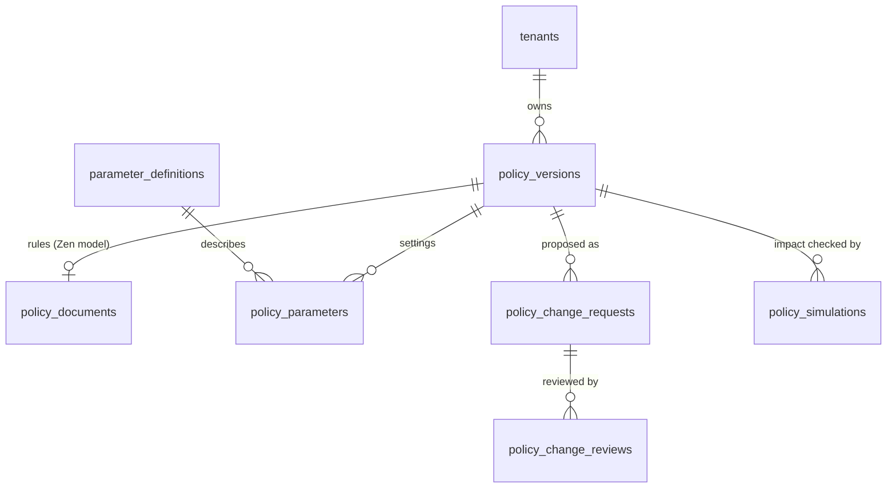
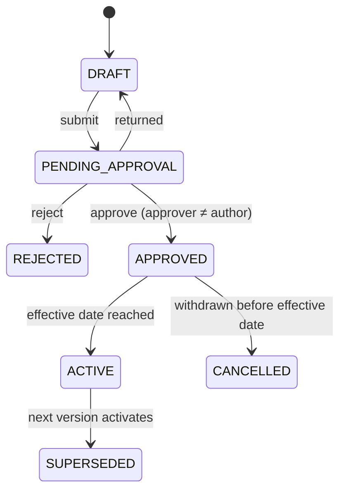

# FD1 — Versioned, approved policy

Backlog: FD1.1 (design), FD1.2 (tables), FD1.3 (seed), FD1.4 (read functions)
Date: 17 Sep 2026

## Goal

Every value that decides or prices a loan — rule thresholds, rates, loadings, caps, charges — is stored as data, changes only through a proposal that someone other than the author approves, takes effect on a set date, and is never overwritten. Any past decision can be traced to the exact values that produced it.

Today these values sit in three places that can drift: `src/lib/policy-rule-engine.ts`, the `policy_rules` / `rate_grid` / `employer_category_pricing` tables, and `src/lib/engine.ts`. Rows are edited in place and `policy_version` is a free-text label.

## Model

### One version = one complete snapshot

A policy version holds **all** values for a product at once: the rules document plus every setting. A change to a single fee still creates a new version, copying everything else from the version it was based on.

Why snapshots rather than per-value dates: a decision then needs one reference (`policy_version_id`) to be fully reproducible, and an approver reviews one coherent package. Versions are small, so copying is cheap.

### Two kinds of content, one source each

| Content | Stored in | Why |
|---|---|---|
| Eligibility rules and their thresholds | `policy_documents.document` — the GoRules Zen decision model (JSON) | The engine evaluates this file directly; keeping thresholds anywhere else would create a second source. The admin console reads and edits the table cells |
| Everything else: rates, loadings, caps, charges, limits | `policy_parameters` — one row per key, typed by `parameter_definitions` | Plain settings read by pricing, KFS and limits code |

### Lifecycle

Rules enforced in the database, not the screen:

1. `approved_by` must differ from `authored_by`.
2. Content (document and parameters) can change only while the version is `DRAFT`.
3. At most one `ACTIVE` version per tenant and product.
4. A draft records the version it was based on. Approving it fails if that base is no longer the latest approved-or-active version — two people editing from the same starting point cannot silently overwrite each other.
5. Effective windows never overlap: activating a version closes the previous one's window at the same instant.
6. Versions are never deleted.

Submit, approve and activate functions belong to Credit control (CC1.1, CC1.2) and get permission checks from FD2. FD1 creates the tables, the guards above, the seed and the read functions only.

### Reading values

- `fn_policy_version_at(product, at)` — the version in force at a moment (default now).
- `fn_policy_param(key, product, at)` — a single setting from that version, as JSONB.
- `fn_policy_document_at(product, at)` — the rules document for the engine.

"In force at T" means `effective_from <= T` and (`effective_to` is null or `effective_to > T`), status `ACTIVE` or `SUPERSEDED`.

### Existing tables during the move

`policy_rules`, `rate_grid` and `employer_category_pricing` stay as they are while the current screens use them. Version `2026.08` is seeded from their present values and from `docs/engine-evaluation/zen-policy.json`, which matched today's browser engine on 2,040 cases. Screens switch to the versioned values behind the `versioned_policy` switch (Credit control), after which the old tables are retired.

### Keys

Dot-separated, lower case: `<area>.<name>[.<qualifier>]`, for example `pricing.base_rate.approve`, `pricing.loading.cat_b`, `charges.processing_fee.cat_a`, `limits.max_loan_amount`. Every key must exist in `parameter_definitions`, which carries its type, unit, allowed range, owning role, approving role, whether it is locked, and the regulation it traces to.

## Not in FD1

- Who may author or approve (FD2 and Admin module)
- Submit / approve / schedule functions and the approval inbox (Credit control)
- Impact simulation job (CC3) — the table exists so results have a home
- Recording `policy_version_id` on decisions (CC5)
